# 🧭 VMigrate: VMware to OpenStack Migration Platform

---

## 1. Project Overview

**VMigrate** is a robust, production-grade platform for migrating virtual machines (VMs) from VMware ESXi/vCenter environments to OpenStack clouds. It automates the full migration lifecycle: VM discovery, disk extraction, format conversion (VMDK → QCOW2), and OpenStack provisioning. The system is designed for reliability, scalability, and auditability, targeting cloud engineers, system administrators, and migration specialists.

**Why VMigrate?**
- VMware-to-OpenStack migration is complex, involving multiple APIs, disk formats, and network topologies.
- VMigrate orchestrates this process, reducing manual effort, minimizing downtime, and ensuring data integrity.

**Key Benefits:**
- **End-to-end automation:** From source VM discovery to OpenStack instance creation.
- **Scalability:** Asynchronous, distributed task processing with Celery and Redis.
- **Reliability:** Robust error handling, retries, and audit trails.
- **Extensibility:** Modular architecture for future cloud targets and custom workflows.

---

## 2. Global Architecture

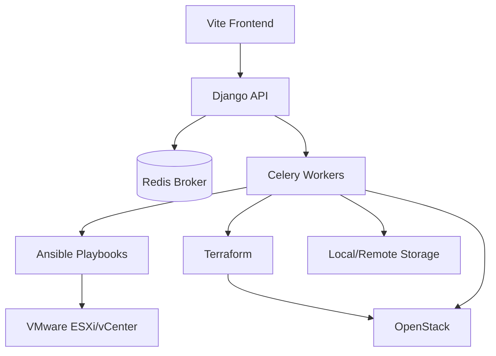

---

## 3. Component Breakdown

### Django Backend

- **Apps:**  
  - `core`: Django settings, Celery config, logging.
  - `migrations`: Migration logic, models, serializers, tasks, Ansible/Terraform integration.
  - `users`: User management and authentication.

- **Models (Extracted from code):**
  - `MigrationJob`: Tracks migration state, metadata, user, source/target endpoints.
    - Fields: `id`, `name`, `status`, `conversion_metadata` (JSONField), `user` (ForeignKey), `source`, `created_at`, `updated_at`, `discovered_vm` (ForeignKey), `vmware_endpoint_session` (ForeignKey), `openstack_endpoint_session` (ForeignKey, nullable).
  - `DiscoveredVM`: Represents a discovered VM.
    - Fields: `id`, `name`, `source`, `disks` (JSONField), `metadata` (JSONField).
  - `VmwareEndpointSession`: Stores ESXi/vCenter connection info.
    - Fields: `id`, `host`, `username`, `password`, `label`.
  - `OpenstackEndpointSession`: Stores OpenStack connection info.
    - Fields: `id`, `auth_url`, `username`, `password`, `project_name`.
  - `User`: Standard Django user, extended with `role`.

- **Serializers:**  
  - Validate and transform API payloads for jobs, endpoints, and user actions.

- **Views:**  
  - Implement REST endpoints for migration jobs, inventory, user management, and logs.

- **Business Logic:**  
  - Handles migration orchestration, state transitions, and validation.

### Celery Workers

- **Async Processing:**  
  - Offloads long-running tasks (discovery, conversion, provisioning) from the API.
- **Task Orchestration:**  
  - Chained and grouped tasks for multi-step workflows.
  - Retries on failure using Celery's retry mechanism (`max_retries`, `retry`).
  - Task states: `PENDING`, `STARTED`, `RETRY`, `FAILURE`, `SUCCESS`.
- **Integration:**  
  - Invokes Ansible and Terraform via subprocess or Python APIs.

### Redis

- **Broker:**  
  - Queues Celery tasks.
- **Cache:**  
  - Stores transient data (e.g., job status, session tokens).

### Ansible

- **VMware Automation:**  
  - Connects to ESXi/vCenter, exports VMs, manages disk extraction.
- **Disk Conversion:**  
  - Orchestrates VMDK to QCOW2 conversion using QEMU.

### Terraform

- **OpenStack Provisioning:**  
  - Automates network, storage, and compute resource creation in OpenStack.

### Vite Frontend

- **UI:**  
  - React-based interface for migration management, monitoring, and configuration.
- **API Integration:**  
  - Communicates with Django backend for all operations.
- **Forms:**  
  - Collects ESXi/vCenter and OpenStack credentials, migration specs, and advanced options.
- **State Management:**  
  - Tracks job status, user sessions, and inventory.

---

## 4. Migration Workflow

### Step-by-Step Pipeline

1. **User submits migration request** via the frontend, specifying source (ESXi/vCenter), target (OpenStack), and migration options.
2. **Backend validates inputs** (credentials, VM selection, network mapping).
3. **Celery task is triggered** to handle the migration asynchronously.
4. **Ansible extracts the VM** from ESXi/vCenter, downloading VMDK disks.
5. **Disk conversion** is performed (VMDK → QCOW2) using QEMU.
6. **Image upload to OpenStack** (Glance) is initiated.
7. **Instance creation** in OpenStack (Nova) with appropriate network (Neutron) and storage (Cinder) configuration.
8. **Status updates** are pushed back to the frontend for user monitoring.

#### Failure Scenarios & Retry Logic

- **Celery Retries:**  
  - Tasks use `max_retries` and `retry` to handle transient failures (e.g., network, API errors).
  - Exponential backoff and error logging are implemented.
- **Task Chaining:**  
  - Migration steps are chained; failure in one step halts the chain and updates job status.
- **Manual Intervention:**  
  - If a job fails after max retries, it is marked as `FAILED` and requires manual review.

#### Data Flow

- **Django API** receives user request, validates, and enqueues a Celery task via Redis.
- **Celery Worker** dequeues the task, orchestrates Ansible/Terraform subprocesses, and updates job state in the database.
- **Ansible** connects to VMware, extracts VMDK disks, and triggers QEMU for conversion.
- **Celery** uploads the converted QCOW2 to OpenStack (Glance) and creates an instance (Nova).
- **Status** is updated in the database and pushed to the frontend via API polling.

#### Mermaid Sequence Diagram

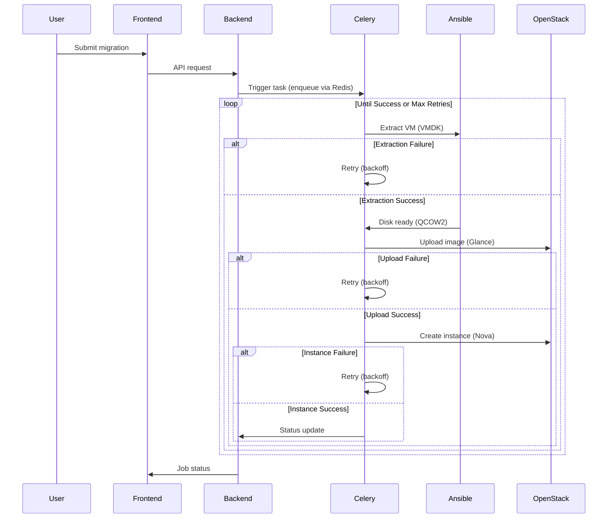

---

## 5. Data Flow Explanation

- **Frontend → Backend:**  
  - User submits migration specs via REST API.
- **Backend → Celery (via Redis):**  
  - Migration job is enqueued as a Celery task.
- **Celery → Ansible/Terraform:**  
  - Celery worker invokes Ansible playbooks and Terraform modules as subprocesses.
- **Ansible → VMware:**  
  - Ansible connects to ESXi/vCenter, exports VMDK disks to local or NFS storage.
- **Celery → OpenStack:**  
  - Celery uploads converted QCOW2 images to Glance, then creates Nova instances.
- **Backend → Frontend:**  
  - Job status and logs are exposed via REST API for frontend polling.

**Communication Mechanisms:**
- **REST API:** Frontend ↔ Backend
- **Redis Queue:** Backend → Celery
- **Subprocess/SSH:** Celery → Ansible/Terraform
- **API Calls:** Ansible → VMware, Celery → OpenStack

---

## 6. Network & Storage Mapping

### Network Mapping

- **VMware Networks:**  
  - Discovered via vCenter/ESXi APIs.
  - User selects or maps source networks to OpenStack Neutron networks via the frontend.
- **OpenStack Neutron:**  
  - Target networks are listed and selectable.
  - The system attempts to auto-map networks by name or prompts for manual mapping.

### Storage & Disk Handling

- **Single/Multiple Disks:**  
  - All VM disks are discovered and listed.
  - User can select which disks to migrate.
- **Disk Formats:**  
  - Source: VMDK (VMware)
  - Target: QCOW2 (OpenStack)
- **Transfer:**  
  - Disks are downloaded to local/NFS storage, converted, and uploaded to OpenStack.
  - Optionally, disks can be stored locally for backup or manual use.

---

## 7. Project Structure

| Path                | Purpose                                                      |
|---------------------|-------------------------------------------------------------|
| `backend/`          | Django project: API, models, Celery, business logic         |
| `backend/core/`     | Core Django app: settings, celery config, logging           |
| `backend/migrations/`| Migration logic: models, tasks, serializers, Ansible, etc. |
| `backend/users/`    | User management (Django app)                                |
| `frontend/`         | Vite.js React frontend                                      |
| `frontend/src/`     | Frontend source code (components, pages, API, assets)       |
| `ansible/`          | Playbooks for VM extraction, conversion, etc.               |
| `terraform/`        | OpenStack provisioning modules and configs                  |
| `images/`           | Disk images, backups, and temp storage                      |
| `scripts/`          | Utility scripts (e.g., dev-stack.sh)                        |
| `docs/`             | Architecture and documentation                              |

---

## 8. Technologies Used

- **Backend:** Django, Django REST Framework
- **Frontend:** Vite.js, React
- **Async Tasks:** Celery
- **Broker/Cache:** Redis
- **Automation:** Ansible
- **Provisioning:** Terraform
- **Virtualization:** VMware ESXi/vCenter APIs
- **Cloud:** OpenStack (Glance, Nova, Neutron, Cinder)
- **Disk Conversion:** QEMU

---

## 9. API Documentation

| Endpoint                        | Method | Purpose                                      |
|----------------------------------|--------|----------------------------------------------|
| `/api/vmware/discover/`         | POST   | Discover VMs on ESXi/vCenter                 |
| `/api/vmware/sessions/`         | GET    | List VMware endpoint sessions                |
| `/api/migrations/`              | POST   | Submit migration job                         |
| `/api/migrations/<id>/status/`  | GET    | Get migration job status                     |
| `/api/openstack/sessions/`      | GET    | List OpenStack endpoint sessions             |
| `/api/openstack/networks/`      | GET    | List available OpenStack networks            |
| `/api/users/`                   | GET    | List users                                   |
| `/api/logs/`                    | GET    | Retrieve migration logs                      |

*Note: See code for full endpoint list and parameters.*

---

## 10. Deployment

### Local Setup

1. **Backend:**
   - Install Python dependencies (`pip install -r requirements.txt`)
   - Configure environment variables (see below)
   - Run migrations: `python manage.py migrate`
   - Start server: `python manage.py runserver`

2. **Frontend:**
   - Install Node dependencies (`npm install`)
   - Start dev server: `npm run dev`

3. **Celery & Redis:**
   - Start Redis server
   - Start Celery worker: `celery -A core worker -l info`

### Production-Ready Architecture

- **Backend and Workers Separation:**  
  - Run Django API and Celery workers as separate processes/containers.
- **Redis as External Service:**  
  - Use a managed Redis instance for reliability and scaling.
- **Scaling Celery Workers:**  
  - Deploy multiple Celery worker instances for parallel migrations.
- **Storage:**  
  - Use shared NFS or object storage for disk images.
- **Security:**  
  - Isolate sensitive credentials using environment variables or secret managers.

### Docker/Kubernetes (Recommended Structure)

- **Docker Compose:**  
  - Services: `django`, `celery`, `redis`, `frontend`, `nginx`
- **Kubernetes:**  
  - Deployments: `django-api`, `celery-worker`, `frontend`
  - StatefulSet: `redis`
  - PersistentVolumeClaims for disk storage
  - Secrets for credentials

---

## 11. Configuration

| Variable                  | Purpose                                 |
|---------------------------|-----------------------------------------|
| `DJANGO_SECRET_KEY`       | Django secret key                       |
| `DATABASE_URL`            | Database connection string              |
| `REDIS_URL`               | Redis broker/cache URL                  |
| `VMWARE_*`                | VMware credentials and config           |
| `OPENSTACK_*`             | OpenStack credentials and config        |
| `MIGRATION_OUTPUT_DIR`    | Directory for disk images               |
| `ARTIFACT_BACKUP_DIR`     | Directory for backup images             |
| `ENABLE_ANSIBLE_CONVERSION`| Toggle Ansible-based conversion        |
| `ENABLE_OPENSTACK_DEPLOYMENT`| Toggle OpenStack deployment          |

*Credentials are handled via environment variables and not stored in code.*

---

## 12. Security

- **Authentication:** Django user model, session-based or token auth.
- **Secrets Management:** All credentials are passed via environment variables or secure forms.
- **API Protection:** Input validation, permission checks, and error handling throughout.

---

## 13. Observability

- **Logging:** Centralized logging for all backend and Celery operations.
- **Monitoring:** No explicit monitoring stack detected; recommend integrating with Prometheus/Grafana.
- **Task Tracking:** Job status and logs available via API and frontend.

---

## 14. Limitations & Edge Cases

- **Large VM Handling:**  
  - Disk size and network throughput may impact migration time and reliability.
  - Storage space must be sufficient for both VMDK and QCOW2 images.
- **Network Mapping:**  
  - Complex topologies may require manual mapping.
  - VLANs, trunking, and advanced Neutron features may not be fully automated.
- **Failure Scenarios:**  
  - Partial migrations, disk conversion errors, and API timeouts are handled with retries, but manual intervention may be required.
  - If a task fails after max retries, the job is marked as `FAILED`.
- **Performance Considerations:**  
  - Disk I/O and network bandwidth are critical bottlenecks.
  - Parallel migrations may saturate storage or network resources.
- **Scaling Challenges:**  
  - Redis and Celery must be tuned for high concurrency.
  - Ansible and QEMU subprocesses may require resource limits.

---

## 15. Future Improvements

- Incremental and delta migration support
- Enhanced UI for monitoring and troubleshooting
- Advanced retry and rollback strategies
- Multi-cloud and hybrid migration support
- Integrated observability (metrics, tracing)
- Automated Docker/K8s deployment
- Improved network and storage mapping automation

---

## 16. Contribution Guide

1. Fork the repository and create a feature branch.
2. Follow PEP8 (backend) and Prettier/ESLint (frontend) standards.
3. Add tests for new features.
4. Submit a pull request with a clear description.

---

## 17. License

See [LICENSE](LICENSE) for details.

---

# 🖼️ Architecture & UML Diagrams

---

## 1. 🧩 UML Component Diagram

**Major components and their interactions:**

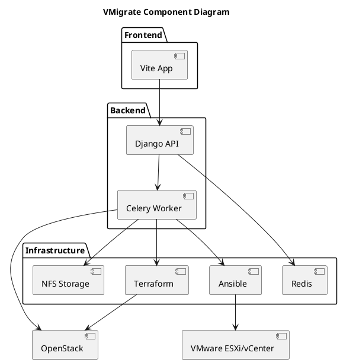

---

## 2. 🔄 UML Sequence Diagram (Migration Flow)

**Complete migration lifecycle with error handling and retries:**

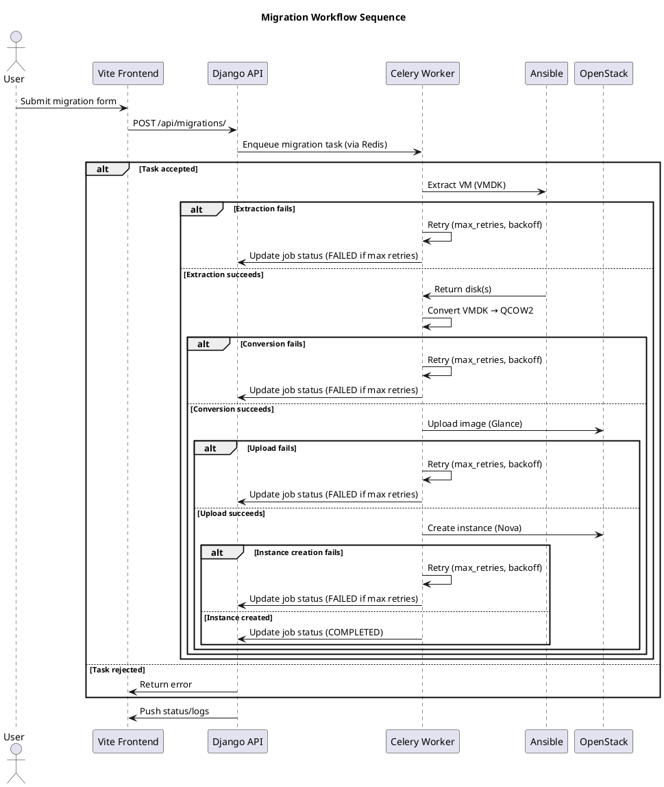

---

## 3. 🧱 UML Class Diagram (Django Backend)

**Key models and relationships (real fields):**

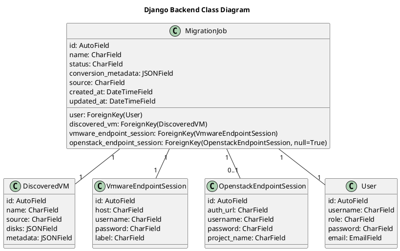

---

## 4. ⚙️ UML Activity Diagram

**Migration workflow logic with decision nodes and retries:**

```plantuml
@startuml
title Migration Workflow Activity

start
:User submits migration;
:Validate input;
if (Valid?) then (yes)
  :Create MigrationJob;
  :Enqueue Celery task;
  repeat
    :Extract VM (Ansible);
    if (Extraction failed?) then (yes)
      :Retry (max_retries?);
      if (Max retries?) then (yes)
        :Mark job FAILED;
        stop
      endif
    endif
  until (Extraction succeeded)
  repeat
    :Convert disk (QEMU);
    if (Conversion failed?) then (yes)
      :Retry (max_retries?);
      if (Max retries?) then (yes)
        :Mark job FAILED;
        stop
      endif
    endif
  until (Conversion succeeded)
  repeat
    :Upload to OpenStack;
    if (Upload failed?) then (yes)
      :Retry (max_retries?);
      if (Max retries?) then (yes)
        :Mark job FAILED;
        stop
      endif
    endif
  until (Upload succeeded)
  repeat
    :Create instance;
    if (Instance failed?) then (yes)
      :Retry (max_retries?);
      if (Max retries?) then (yes)
        :Mark job FAILED;
        stop
      endif
    endif
  until (Instance created)
  :Update status (COMPLETED);
  stop
else (no)
  :Return error;
  stop
endif

@enduml
```

---

## 5. 🚀 UML Deployment Diagram

**Production deployment with separation and scaling:**

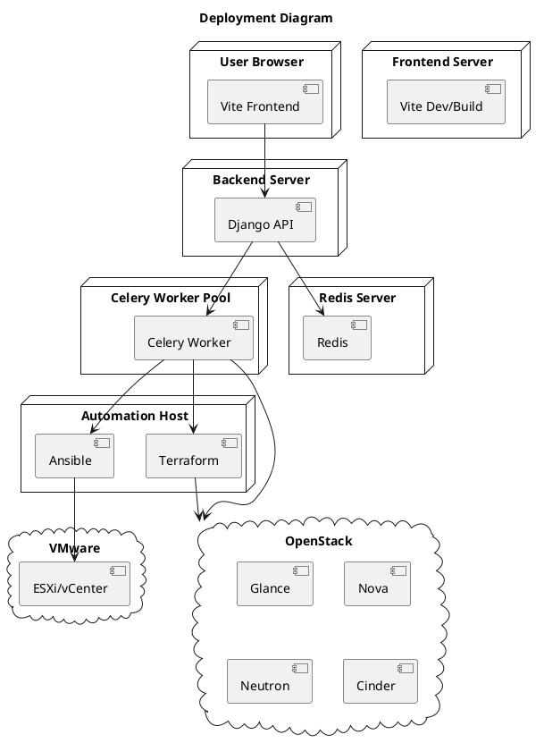

---

## 6. 🧵 UML State Machine Diagram

**Migration job lifecycle with failure and retry states:**

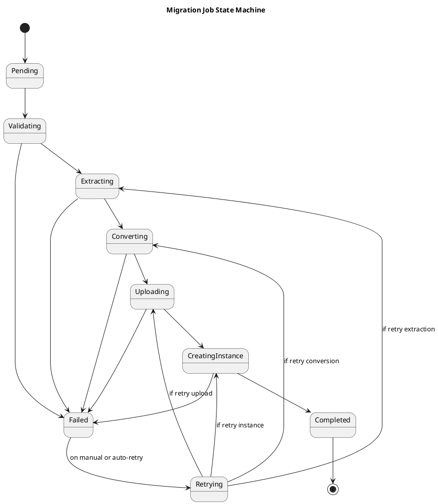

---

*This README and diagrams are based strictly on code analysis as of April 2026. All technical details, models, and workflows reflect the actual codebase. Any assumptions or inferences are explicitly stated. For further details, consult the codebase or contact the maintainers.*
# 🧭 VMigrate: VMware to OpenStack Migration Platform

---

## 1. Project Overview

**VMigrate** is a production-grade platform for migrating virtual machines (VMs) from VMware ESXi/vCenter environments to OpenStack clouds. It automates the end-to-end process of VM discovery, disk extraction, format conversion (VMDK → QCOW2), and OpenStack provisioning, providing a scalable, reliable, and auditable migration workflow.

**Why VMigrate?**
- Migrating workloads from legacy VMware to OpenStack is complex, error-prone, and time-consuming.
- VMigrate addresses these challenges by orchestrating the entire migration pipeline, integrating with both VMware and OpenStack APIs, and leveraging automation tools (Ansible, Terraform) for infrastructure operations.

**Key Benefits:**
- **End-to-end automation:** From source VM discovery to OpenStack instance creation.
- **Scalability:** Async task processing with Celery and Redis.
- **Reliability:** Robust error handling, retries, and audit trails.
- **Extensibility:** Modular architecture for future cloud targets.

---

## 2. Global Architecture

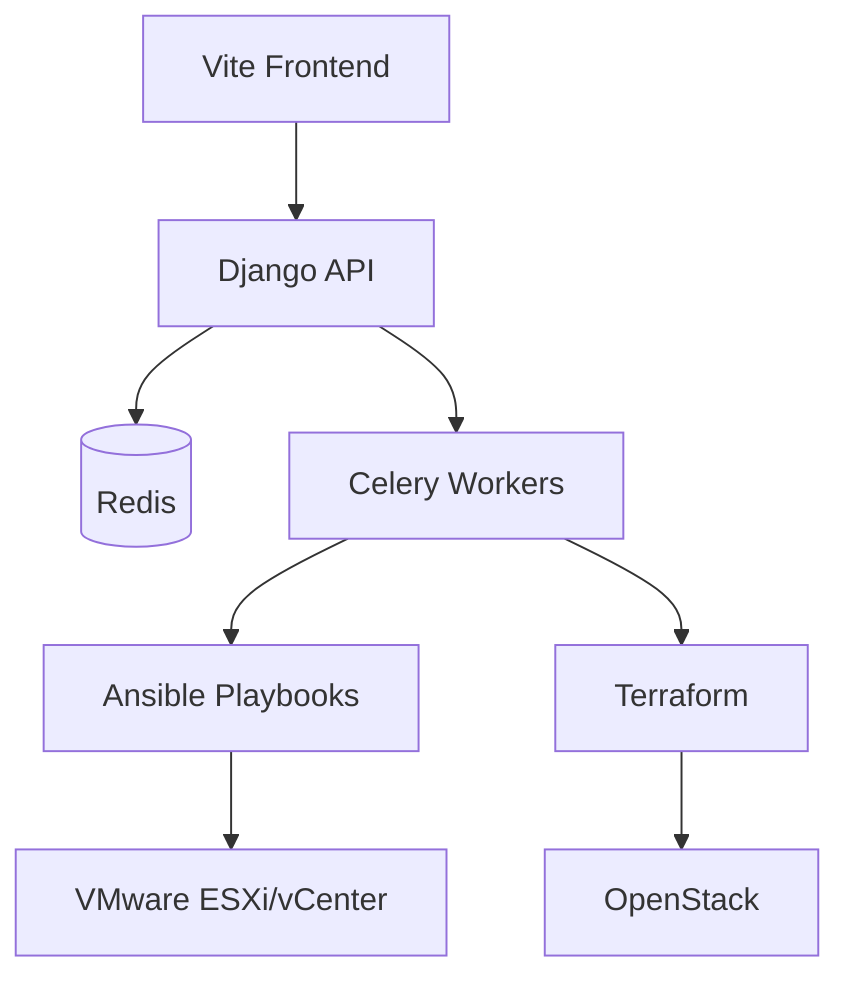

---

## 3. Component Breakdown

### Django Backend
- **API Layer:** Exposes REST endpoints for migration jobs, inventory, user management, and status tracking.
- **Business Logic:** Handles validation, job orchestration, and state transitions.
- **Models:** Represent migration jobs, discovered VMs, endpoints, and user data.
- **Serializers:** Validate and transform API payloads.
- **Views:** Implement core migration workflows and status reporting.

### Celery Workers
- **Async Processing:** Offloads long-running tasks (discovery, conversion, provisioning) from the API.
- **Task Orchestration:** Manages retries, error handling, and state updates.
- **Integration:** Invokes Ansible and Terraform for infrastructure operations.

### Redis
- **Broker:** Queues Celery tasks.
- **Cache:** Stores transient data (e.g., job status, session tokens).

### Ansible
- **VMware Automation:** Connects to ESXi/vCenter, exports VMs, and manages disk extraction.
- **Disk Conversion:** Orchestrates VMDK to QCOW2 conversion using QEMU.

### Terraform
- **OpenStack Provisioning:** Automates network, storage, and compute resource creation in OpenStack.

### Vite Frontend
- **UI:** React-based interface for migration management, monitoring, and configuration.
- **API Integration:** Communicates with Django backend for all operations.
- **Forms:** Collects ESXi/vCenter and OpenStack credentials, migration specs, and advanced options.
- **State Management:** Tracks job status, user sessions, and inventory.

---

## 4. Migration Workflow

### Step-by-Step Pipeline

1. **User submits migration request** via the frontend, specifying source (ESXi/vCenter), target (OpenStack), and migration options.
2. **Backend validates inputs** (credentials, VM selection, network mapping).
3. **Celery task is triggered** to handle the migration asynchronously.
4. **Ansible extracts the VM** from ESXi/vCenter, downloading VMDK disks.
5. **Disk conversion** is performed (VMDK → QCOW2) using QEMU.
6. **Image upload to OpenStack** (Glance) is initiated.
7. **Instance creation** in OpenStack (Nova) with appropriate network (Neutron) and storage (Cinder) configuration.
8. **Status updates** are pushed back to the frontend for user monitoring.

#### Mermaid Sequence Diagram

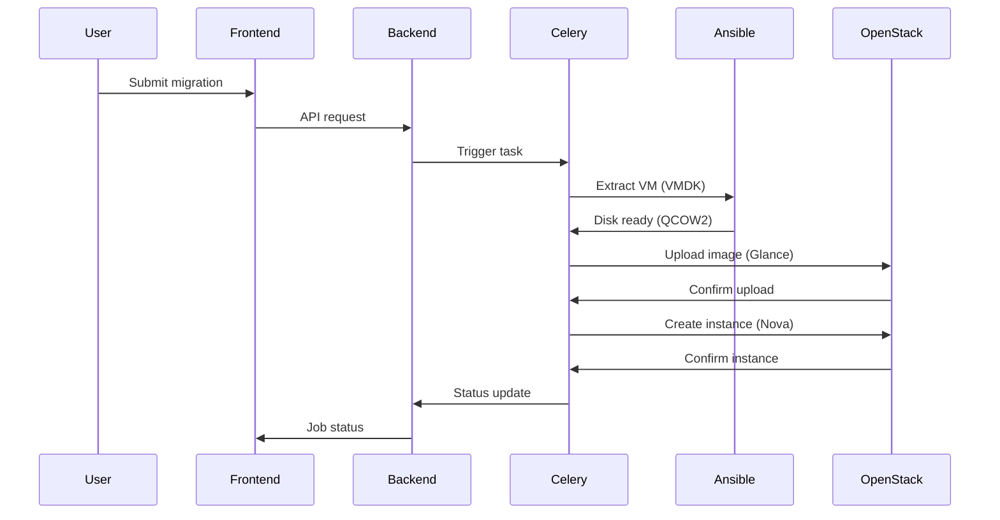

---

## 5. Project Structure

| Path                | Purpose                                                      |
|---------------------|-------------------------------------------------------------|
| `backend/`          | Django project: API, models, Celery, business logic         |
| `backend/core/`     | Core Django app: settings, celery config, logging           |
| `backend/migrations/`| Migration logic: models, tasks, serializers, Ansible, etc. |
| `backend/users/`    | User management (Django app)                                |
| `frontend/`         | Vite.js React frontend                                      |
| `frontend/src/`     | Frontend source code (components, pages, API, assets)       |
| `ansible/`          | Playbooks for VM extraction, conversion, etc.               |
| `terraform/`        | OpenStack provisioning modules and configs                  |
| `images/`           | Disk images, backups, and temp storage                      |
| `scripts/`          | Utility scripts (e.g., dev-stack.sh)                        |
| `docs/`             | Architecture and documentation                              |

---

## 6. Technologies Used

- **Backend:** Django, Django REST Framework
- **Frontend:** Vite.js, React
- **Async Tasks:** Celery
- **Broker/Cache:** Redis
- **Automation:** Ansible
- **Provisioning:** Terraform
- **Virtualization:** VMware ESXi/vCenter APIs
- **Cloud:** OpenStack (Glance, Nova, Neutron, Cinder)
- **Disk Conversion:** QEMU

---

## 7. API Documentation

| Endpoint                        | Method | Purpose                                      |
|----------------------------------|--------|----------------------------------------------|
| `/api/vmware/discover/`         | POST   | Discover VMs on ESXi/vCenter                 |
| `/api/vmware/sessions/`         | GET    | List VMware endpoint sessions                |
| `/api/migrations/`              | POST   | Submit migration job                         |
| `/api/migrations/<id>/status/`  | GET    | Get migration job status                     |
| `/api/openstack/sessions/`      | GET    | List OpenStack endpoint sessions             |
| `/api/openstack/networks/`      | GET    | List available OpenStack networks            |
| `/api/users/`                   | GET    | List users                                   |
| `/api/logs/`                    | GET    | Retrieve migration logs                      |

*Note: See code for full endpoint list and parameters.*

---

## 8. Deployment

### Local Setup

1. **Backend:**
   - Install Python dependencies (`pip install -r requirements.txt`)
   - Configure environment variables (see below)
   - Run migrations: `python manage.py migrate`
   - Start server: `python manage.py runserver`

2. **Frontend:**
   - Install Node dependencies (`npm install`)
   - Start dev server: `npm run dev`

3. **Celery & Redis:**
   - Start Redis server
   - Start Celery worker: `celery -A core worker -l info`

### Docker/Kubernetes

- No official Docker/K8s manifests detected in the codebase. Add as needed for production.

---

## 9. Configuration

| Variable                  | Purpose                                 |
|---------------------------|-----------------------------------------|
| `DJANGO_SECRET_KEY`       | Django secret key                       |
| `DATABASE_URL`            | Database connection string              |
| `REDIS_URL`               | Redis broker/cache URL                  |
| `VMWARE_*`                | VMware credentials and config           |
| `OPENSTACK_*`             | OpenStack credentials and config        |
| `MIGRATION_OUTPUT_DIR`    | Directory for disk images               |
| `ARTIFACT_BACKUP_DIR`     | Directory for backup images             |
| `ENABLE_ANSIBLE_CONVERSION`| Toggle Ansible-based conversion        |
| `ENABLE_OPENSTACK_DEPLOYMENT`| Toggle OpenStack deployment          |

*Credentials are handled via environment variables and not stored in code.*

---

## 10. Security

- **Authentication:** Django user model, session-based or token auth.
- **Secrets Management:** All credentials are passed via environment variables or secure forms.
- **API Protection:** Input validation, permission checks, and error handling throughout.

---

## 11. Observability

- **Logging:** Centralized logging for all backend and Celery operations.
- **Monitoring:** No explicit monitoring stack detected; recommend integrating with Prometheus/Grafana.
- **Task Tracking:** Job status and logs available via API and frontend.

---

## 12. Limitations & Edge Cases

- **Large VM Handling:** Disk size and network throughput may impact migration time.
- **Network Mapping:** Complex topologies may require manual mapping.
- **Failure Scenarios:** Partial migrations, disk conversion errors, and API timeouts are handled with retries, but manual intervention may be required.
- **No built-in Docker/K8s:** Production deployments require custom manifests.

---

## 13. Future Improvements

- Incremental and delta migration support
- Enhanced UI for monitoring and troubleshooting
- Advanced retry and rollback strategies
- Multi-cloud and hybrid migration support
- Integrated observability (metrics, tracing)
- Automated Docker/K8s deployment

---

## 14. Contribution Guide

1. Fork the repository and create a feature branch.
2. Follow PEP8 (backend) and Prettier/ESLint (frontend) standards.
3. Add tests for new features.
4. Submit a pull request with a clear description.

---

## 15. License

See [LICENSE](LICENSE) for details.

---

# 🖼️ Architecture & UML Diagrams

---

## 1. 🧩 UML Component Diagram

**Major components and their interactions:**

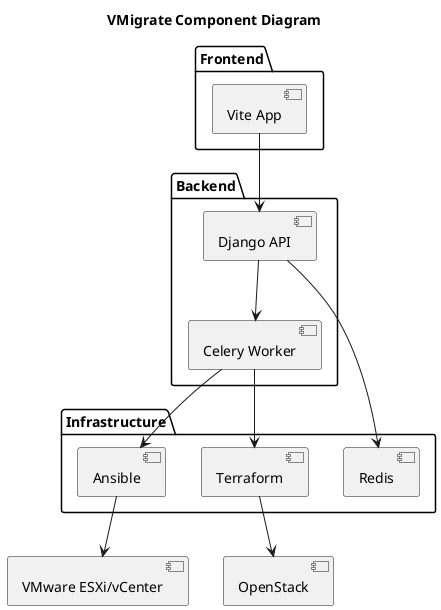

---

## 2. 🔄 UML Sequence Diagram (Migration Flow)

**Complete migration lifecycle:**

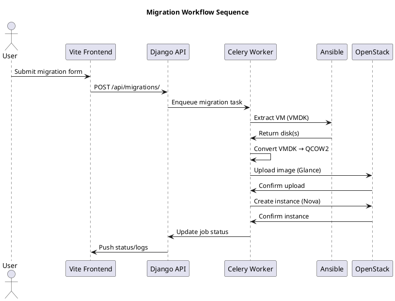

---

## 3. 🧱 UML Class Diagram (Django Backend)

**Key models and relationships:**

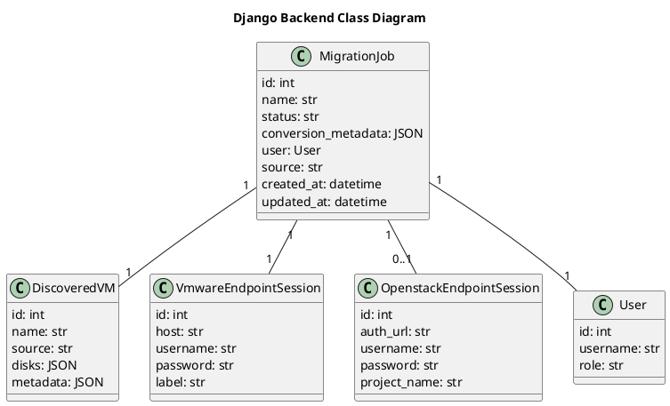

---

## 4. ⚙️ UML Activity Diagram

**Migration workflow logic:**

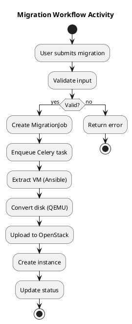

---

## 5. 🚀 UML Deployment Diagram

**Infrastructure deployment:**

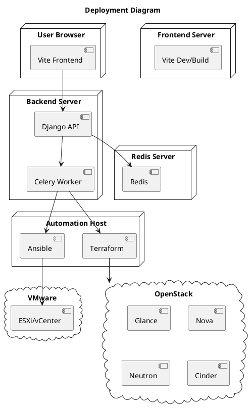

---

## 6. 🧵 UML State Machine Diagram

**Migration job lifecycle:**

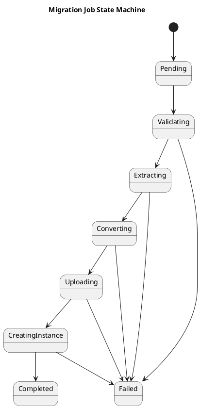

---

*This README and diagrams are based strictly on code analysis as of April 2026. If any aspect is unclear or inferred, it is explicitly noted above. For further details, consult the codebase or contact the maintainers.*
# VMigrate

VMigrate is a Django and Celery platform for migrating VMware virtual machines to OpenStack (DevStack-friendly).

It provides:
- Endpoint onboarding for VMware and OpenStack
- VM discovery and migration job orchestration
- Conversion planning and execution with virt-v2v or qemu-img pipelines
- Disk and filesystem validation before deployment
- Optional OpenStack deployment as boot-from-volume instances
- Rollback support for failed migration runs

For architecture-focused details, see [docs/architecture.md](docs/architecture.md).

## Project Overview

### What VMigrate solves

Migrating VMs from VMware to OpenStack is operationally complex. Teams usually need to manually combine discovery, conversion, image upload, volume handling, server boot, networking fixes, and post-checks.

VMigrate centralizes these steps into a controlled workflow with auditable states and API-driven operations.

### Key capabilities

- Discover VMs from VMware Workstation/Fusion-style paths and ESXi endpoints
- Create and track migration jobs through explicit states
- Convert source disks to OpenStack-compatible formats
- Preserve multi-disk ordering and boot-disk selection
- Upload artifacts to Glance and create Cinder volumes
- Boot Nova instances from volume and attach remaining disks
- Apply Linux guest network remediation when needed
- Detect guest OS profile and handle Linux/Windows flows safely

## Architecture

VMigrate has four main runtime layers:

- Frontend (React + Vite)
- Backend API (Django REST)
- Async execution (Celery + Redis)
- Infrastructure/tooling integrations (VMware, OpenStack, conversion tools)

~~~mermaid
flowchart LR
  U[Operator] --> FE[React Frontend]
  FE --> API[Django REST API]
  API --> DB[(Database)]
  API --> R[(Redis)]
  R --> W[Celery Worker]

  W --> VMW[VMware Sources]
  W --> TOOLS[virt-v2v qemu-img libguestfs]
  W --> OS[OpenStack APIs]

  API --> TF[Terraform Optional]
  W --> ANS[Ansible Optional]
~~~

## Features

### VM migration workflow

- Precheck and source validation
- Optional snapshot creation for ESXi source VMs
- Disk analysis and conversion execution
- Block and filesystem validation
- Optional OpenStack deployment and verification
- Rollback on failure

### Networking handling

- OpenStack network and floating IP selection/validation
- Optional baseline access security group management
- Linux guest first-boot remediation service injection via virt-customize

### OS support

Current behavior in code:
- Linux family support with distro detection (including Ubuntu, Debian, CentOS, RHEL, Rocky, AlmaLinux, Fedora, SUSE, Arch, and generic Linux fallback)
- Windows family detection and safe handling
- Unknown OS fallback with optional strict failure mode

Important: remediation script injection is Linux-oriented. Windows guests skip Linux remediation paths by design.

## How It Works

High-level migration lifecycle:

~~~mermaid
stateDiagram-v2
  [*] --> PENDING
  PENDING --> DISCOVERED
  DISCOVERED --> PRECHECK
  PRECHECK --> SNAPSHOT_CREATED
  SNAPSHOT_CREATED --> DISK_ANALYZING
  DISK_ANALYZING --> CONVERTING
  CONVERTING --> BLOCK_VALIDATING
  BLOCK_VALIDATING --> UPLOADING
  UPLOADING --> DEPLOYED
  DEPLOYED --> VERIFIED

  PENDING --> FAILED
  DISCOVERED --> FAILED
  PRECHECK --> FAILED
  SNAPSHOT_CREATED --> FAILED
  DISK_ANALYZING --> FAILED
  CONVERTING --> FAILED
  BLOCK_VALIDATING --> FAILED
  UPLOADING --> FAILED
  DEPLOYED --> FAILED
  FAILED --> ROLLED_BACK
~~~

Step-by-step execution:

1. User submits migration from discovered VMware VM(s).
2. Backend creates MigrationJob records and enqueues Celery tasks.
3. Worker runs precheck, conversion planning, and optional snapshot.
4. Worker executes conversion and artifact validation.
5. Worker detects guest OS and applies OS-aware behavior.
6. If OpenStack deployment is enabled, worker uploads image(s), creates volume(s), boots server, attaches disks, and validates.
7. Job transitions to VERIFIED or FAILED, with rollback if enabled.

## OpenStack Integration

VMigrate uses openstacksdk and integrates with the following services:

- Keystone: authentication and endpoint/session validation
- Glance: image upload and lifecycle
- Cinder: volume creation from image and attachment checks
- Nova: server creation and state verification
- Neutron: network selection, floating IP orchestration, and security group baseline logic

Current deployment model is boot-from-volume (not direct ephemeral boot from image).

## Installation and Setup

### Prerequisites

Minimum runtime prerequisites:
- Linux host with Python 3.12+ and Node.js (frontend)
- Redis for Celery broker/result backend
- VMware access (Workstation paths and/or ESXi endpoint)
- OpenStack credentials (clouds.yaml and/or OS_* variables)

Conversion host tools typically required:
- virt-v2v
- qemu-img
- libguestfs toolchain (virt-inspector, virt-filesystems, guestfish, virt-customize)

### 1) Backend environment

Use your project virtual environment and create backend environment file.

~~~bash
cd backend
cp .env.example .env
~~~

Set at least:
- SECRET_KEY
- DATABASE_URL
- REDIS_URL
- ENABLE_REAL_CONVERSION
- ENABLE_OPENSTACK_DEPLOYMENT
- MIGRATION_OUTPUT_DIR

### 2) Database migration

~~~bash
cd backend
../.venv/bin/python manage.py migrate
~~~

### 3) Start backend API

~~~bash
cd backend
../.venv/bin/python manage.py runserver 0.0.0.0:8000
~~~

### 4) Start Celery worker

~~~bash
cd backend
../.venv/bin/celery -A core worker -l info --concurrency=${CELERY_WORKER_CONCURRENCY:-2}
~~~

Optional periodic discovery scheduler:

~~~bash
cd backend
../.venv/bin/celery -A core beat -l INFO
~~~

### 5) Start frontend

~~~bash
cd frontend
npm install
npm run dev -- --host
~~~

### 6) Optional helper script

You can use the process supervisor script for local orchestration:

~~~bash
bash scripts/dev-stack.sh start
bash scripts/dev-stack.sh status
bash scripts/dev-stack.sh stop
~~~

## Usage

Typical operator flow in UI:

1. Connect VMware endpoint.
2. Connect OpenStack endpoint.
3. Run discovery.
4. Select VM(s) and target overrides.
5. Submit migration.
6. Monitor job states in dashboard/job views.

Useful API endpoints (base path: /api):

- Authentication and users
  - POST /api/auth/register
  - POST /api/auth/login
  - POST /api/auth/refresh
  - GET /api/auth/me
  - GET /api/users/
  - GET /api/users/{id}/

- Health and dashboard
  - GET /api/health
  - GET /api/dashboard
  - GET /api/openstack/health

- VMware
  - GET /api/vmware/vms
  - POST /api/vmware/discover-now
  - POST /api/vmware/endpoints/test
  - POST /api/vmware/endpoints/connect
  - GET /api/vmware/endpoints/{id}
  - POST /api/vmware/endpoints/close

- OpenStack
  - GET /api/openstack/images
  - GET /api/openstack/flavors
  - GET /api/openstack/networks
  - POST /api/openstack/networks/create
  - POST /api/openstack/endpoints/test
  - POST /api/openstack/endpoints/connect
  - GET /api/openstack/endpoints/{id}
  - POST /api/openstack/endpoints/close
  - POST /api/openstack/provision
  - GET /api/openstack/provision/status

- Migrations and tasks
  - GET /api/migrations
  - GET /api/migrations/{job_id}
  - POST /api/migrations/from-vmware
  - POST /api/migrations/{job_id}/start
  - POST /api/migrations/{job_id}/rollback
  - GET /api/tasks/{task_id}

## Project Structure

~~~text
vm-migrator/
├── README.md
├── docs/
│   └── architecture.md
├── scripts/
│   └── dev-stack.sh
├── backend/
│   ├── manage.py
│   ├── core/
│   │   ├── settings.py
│   │   ├── urls.py
│   │   └── celery.py
│   ├── migrations/
│   │   ├── views.py
│   │   ├── urls.py
│   │   ├── tasks.py
│   │   ├── models.py
│   │   ├── vmware_client.py
│   │   ├── openstack_client.py
│   │   ├── openstack_deployment.py
│   │   ├── conversion.py
│   │   ├── disk_formats.py
│   │   ├── disk_inspection.py
│   │   ├── block_validation.py
│   │   ├── filesystem_check.py
│   │   ├── network_remediation.py
│   │   ├── os_profile.py
│   │   ├── snapshot_manager.py
│   │   ├── terraform_runner.py
│   │   └── ansible_runner.py
│   └── users/
│       ├── views.py
│       ├── urls.py
│       └── serializers.py
├── frontend/
│   ├── package.json
│   └── src/
├── ansible/
│   ├── inventory/
│   └── playbooks/
└── terraform/
    ├── provider.tf
    ├── network.tf
    ├── security.tf
    └── modules/
~~~

## Configuration

Main runtime configuration is in:
- backend/.env (from backend/.env.example)
- backend/core/settings.py

Key environment variables:

- Core and runtime
  - DEBUG
  - SECRET_KEY
  - ALLOWED_HOSTS
  - DATABASE_URL
  - REDIS_URL

- Celery and discovery
  - CELERY_WORKER_CONCURRENCY
  - ENABLE_PERIODIC_DISCOVERY
  - DISCOVERY_INTERVAL_SECONDS
  - DISCOVERY_INCLUDE_WORKSTATION
  - DISCOVERY_INCLUDE_ESXI

- Conversion and artifacts
  - ENABLE_REAL_CONVERSION
  - MIGRATION_OUTPUT_DIR
  - VIRT_V2V_TIMEOUT_SECONDS
  - ENABLE_ARTIFACT_BACKUP
  - ARTIFACT_BACKUP_DIR
  - ENABLE_ROLLBACK

- OS-aware behavior
  - ENABLE_GUEST_NETWORK_REMEDIATION
  - GUEST_NETWORK_REMEDIATION_TIMEOUT_SECONDS
  - GUEST_NETWORK_DISABLE_CLOUD_INIT_NETWORK_CONFIG
  - MIGRATION_FAIL_ON_UNSUPPORTED_OS

- VMware
  - VMWARE_WORKSTATION_PATHS
  - VMWARE_ESXI_HOST
  - VMWARE_ESXI_PORT
  - VMWARE_ESXI_USERNAME
  - VMWARE_ESXI_PASSWORD
  - VMWARE_ESXI_CONVERSION_TRANSPORT
  - VMWARE_VDDK_LIBDIR
  - VMWARE_VDDK_THUMBPRINT

- OpenStack
  - ENABLE_OPENSTACK_DEPLOYMENT
  - OPENSTACK_CLOUD_NAME
  - OPENSTACK_DEFAULT_NETWORK
  - OPENSTACK_DEFAULT_EXTERNAL_NETWORK
  - OPENSTACK_IMAGE_ENDPOINT_OVERRIDE
  - OPENSTACK_VERIFY_TIMEOUT
  - OPENSTACK_IMAGE_UPLOAD_TIMEOUT
  - OPENSTACK_API_RETRIES
  - OPENSTACK_API_RETRY_DELAY
  - OS_AUTH_URL
  - OS_USERNAME
  - OS_PASSWORD
  - OS_PROJECT_NAME
  - OS_USER_DOMAIN_NAME
  - OS_PROJECT_DOMAIN_NAME
  - OS_REGION_NAME
  - OS_INTERFACE
  - OS_VERIFY

## Limitations

Current codebase limitations:

- Source platforms are VMware-focused (Workstation/Fusion-style and ESXi paths)
- Conversion quality depends on external toolchain availability and host permissions
- Linux guest network remediation is not intended for Windows guests
- OpenStack deployment is optional and disabled by default (must be enabled explicitly)
- Some environments may need manual tuning for VDDK, libguestfs, and OpenStack endpoint behavior

## Future Improvements

Planned and recommended enhancements:

- Expand OS coverage matrix and distro-specific post-migration checks
- Add Windows-specific post-migration networking/agent remediation options
- Improve performance for large multi-disk migrations (parallelism, caching, resumability)
- Add richer observability (metrics, tracing, SLA dashboards)
- Add integration/e2e test suites against reproducible DevStack labs
- Improve API documentation and publish OpenAPI schema examples

## Security Notes

- Treat endpoint credentials as sensitive and rotate regularly.
- Keep TLS verification enabled outside lab/dev environments.
- Restrict API exposure and protect JWT secrets and database credentials.

## Additional Documentation

- Architecture details: [docs/architecture.md](docs/architecture.md)
- Security and hardening notes: [SECURITY_REMEDIATION.md](SECURITY_REMEDIATION.md)
