# 🧭 VMigrate: VMware to OpenStack Migration Platform

---

## 1. Project Overview

**VMigrate** is a production-grade platform for migrating virtual machines (VMs) from VMware ESXi/vCenter environments to OpenStack clouds. It automates the end-to-end process of VM discovery, disk extraction, format conversion (VMDK → QCOW2), and OpenStack provisioning, providing a scalable, reliable, and auditable migration workflow.

**Why VMigrate?**
- Migrating workloads from legacy VMware to OpenStack is complex, error-prone, and time-consuming.
- VMigrate addresses these challenges by orchestrating the entire migration pipeline, integrating with both VMware and OpenStack APIs, and leveraging automation tools (Ansible, Terraform) for infrastructure operations.

**Key Benefits:**
- **End-to-end automation:** From source VM discovery to OpenStack instance creation.
- **Scalability:** Async task processing with Celery and Redis for handling multiple concurrent migrations.
- **Reliability:** Robust error handling, exponential backoff retries, and comprehensive audit trails.
- **Extensibility:** Modular architecture for future cloud targets and storage backends.
- **Flexible Storage:** Supports both local and NFS storage for scalable VM disk management.

---

## 2. Global Architecture

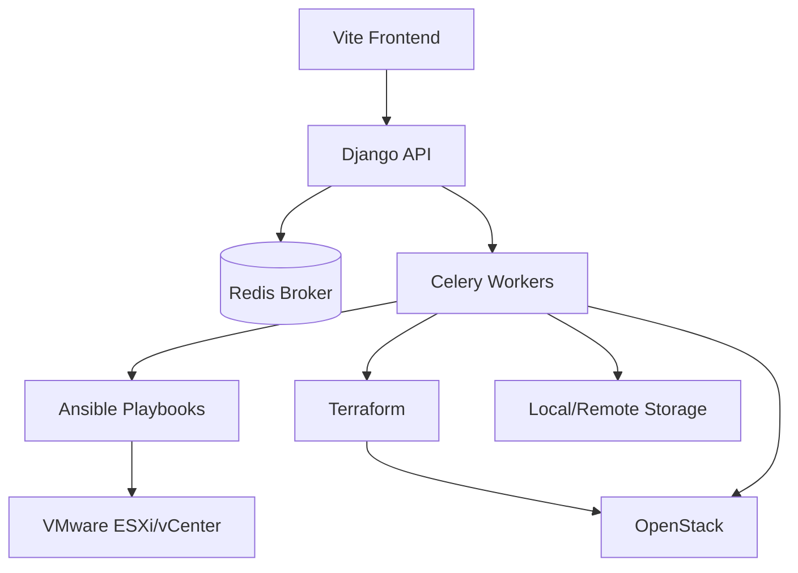
```mermaid
graph TD
    UI[Vite Frontend] --> API[Django API]
    API --> Redis[(Redis Broker)]
    API --> Celery[Celery Workers]
    Celery --> Ansible[Ansible Playbooks]
    Celery --> Terraform[Terraform]
    Ansible --> ESXi[VMware ESXi/vCenter]
    Terraform --> OpenStack[OpenStack]
    Celery --> OpenStack
    Celery --> Storage[Local/Remote Storage]
```

---

## 3. Component Breakdown

### Django Backend

- **Apps:**  
  - `core`: Django settings, Celery config, logging.
  - `migrations`: Migration logic, models, serializers, tasks, Ansible/Terraform integration.
  - `users`: User management and authentication.

- **Models (Extracted from code):**
  - `MigrationJob`: Tracks migration state, metadata, user, source/target endpoints.
    - Fields: `id`, `name`, `status`, `conversion_metadata` (JSONField), `user` (ForeignKey), `source`, `created_at`, `updated_at`, `discovered_vm` (ForeignKey), `vmware_endpoint_session` (ForeignKey), `openstack_endpoint_session` (ForeignKey, nullable).
  - `DiscoveredVM`: Represents a discovered VM.
    - Fields: `id`, `name`, `source`, `disks` (JSONField), `metadata` (JSONField).
  - `VmwareEndpointSession`: Stores ESXi/vCenter connection info.
    - Fields: `id`, `host`, `username`, `password`, `label`.
  - `OpenstackEndpointSession`: Stores OpenStack connection info.
    - Fields: `id`, `auth_url`, `username`, `password`, `project_name`.
  - `User`: Standard Django user, extended with `role`.

- **Serializers:**  
  - Validate and transform API payloads for jobs, endpoints, and user actions.

- **Views:**  
  - Implement REST endpoints for migration jobs, inventory, user management, and logs.

- **Business Logic:**  
  - Handles migration orchestration, state transitions, and validation.

### Celery Workers

- **Async Processing:**  
  - Offloads long-running tasks (discovery, conversion, provisioning) from the API.
- **Task Orchestration:**  
  - Chained and grouped tasks for multi-step workflows.
  - Retries on failure using Celery's retry mechanism (`max_retries`, `retry`).
  - Task states: `PENDING`, `STARTED`, `RETRY`, `FAILURE`, `SUCCESS`.
- **Integration:**  
  - Invokes Ansible and Terraform via subprocess or Python APIs.

### Redis

- **Broker:**  
  - Queues Celery tasks.
- **Cache:**  
  - Stores transient data (e.g., job status, session tokens).

### Ansible

- **VMware Automation:**  
  - Connects to ESXi/vCenter, exports VMs, manages disk extraction.
- **Disk Conversion:**  
  - Orchestrates VMDK to QCOW2 conversion using QEMU.

### Terraform

- **OpenStack Provisioning:**  
  - Automates network, storage, and compute resource creation in OpenStack.

### Vite Frontend

- **UI:**  
  - React-based interface for migration management, monitoring, and configuration.
- **API Integration:**  
  - Communicates with Django backend for all operations.
- **Forms:**  
  - Collects ESXi/vCenter and OpenStack credentials, migration specs, and advanced options.
- **State Management:**  
  - Tracks job status, user sessions, and inventory.

---

## 4. Migration Workflow

### Step-by-Step Pipeline

1. **User submits migration request** via the frontend, specifying source (ESXi/vCenter), target (OpenStack), and migration options.
2. **Backend validates inputs** (credentials, VM selection, network mapping).
3. **Celery task is triggered** to handle the migration asynchronously.
4. **Ansible extracts the VM** from ESXi/vCenter, downloading VMDK disks to local or NFS storage.
5. **Disk conversion** is performed (VMDK → QCOW2) using QEMU tools.
6. **Backup artifacts** are optionally stored for recovery and auditing.
7. **Image upload to OpenStack** (Glance) is initiated with configurable timeouts and retry policies.
8. **Network remediation** is applied if needed, adapting guest OS network configuration for OpenStack.
9. **Instance creation** in OpenStack (Nova) with appropriate network (Neutron) and storage (Cinder) configuration.
10. **Status updates** are pushed back to the frontend and logged for audit trails.

#### Failure Scenarios & Retry Logic

**Celery Task Retries:**
- Tasks use `CELERY_TASK_DEFAULT_RETRY_DELAY` (default: 30 seconds) with exponential backoff.
- Each migration step enforces `max_retries` (configurable per step) before marking the job as `FAILED`.
- Failed tasks log detailed error information for debugging and manual intervention.

**Failure Handling Strategy:**
- **Transient Failures (Network, API timeouts):** Automatically retried with backoff.
- **Validation Errors (Invalid credentials, missing VM):** Marked as `FAILED` immediately; no retry.
- **Storage Issues (Insufficient disk space, NFS unavailable):** Retried if storage becomes available.
- **Ansible Extraction Failures:** Retried up to configured limit; logs include VMDK download details and conversion metadata.
- **OpenStack Upload Failures:** Retried with extended timeout (`OPENSTACK_IMAGE_UPLOAD_TIMEOUT`); partial uploads are cleaned up.
- **Manual Intervention:** If max retries exceeded, job is marked `FAILED` and requires user review and manual restart.

**Async Execution Model:**
- All migration operations are enqueued as Celery tasks via Redis broker.
- The frontend polls `/api/migrations/<id>/status/` to fetch job state, logs, and progress.
- Long-running operations (disk conversion, upload) do not block the API; the backend remains responsive.
- Multiple migrations can be queued and processed in parallel by Celery workers.

#### Data Flow

- **Django API** receives user request, validates, and enqueues a Celery task via Redis.
- **Celery Worker** dequeues the task, orchestrates Ansible/Terraform subprocesses, and updates job state in the database.
- **Ansible** connects to VMware, extracts VMDK disks, and triggers QEMU for conversion (can use local or NFS storage).
- **Celery** uploads the converted QCOW2 to OpenStack (Glance) and creates an instance (Nova).
- **Status** is updated in the database and exposed via API for frontend polling.

---

## 6. 🐳 Docker Deployment Guide

### 📋 Prerequisites

Ensure the following tools are installed on your system:

| Tool | Minimum Version | Purpose |
|------|-----------------|---------|
| Docker | 20.10+ | Container runtime |
| Docker Compose | 1.29+ | Multi-container orchestration |
| Git | 2.25+ | Version control |
| Make | 3.81+ (optional) | Task automation |

**Installation:**
```bash
# Ubuntu/Debian
sudo apt-get update && sudo apt-get install -y docker.io docker-compose git

# macOS (using Homebrew)
brew install docker docker-compose git

# Verify installations
docker --version && docker-compose --version && git --version
```

### ⚙️ Environment Setup

#### Create .env File

Copy the example environment file and customize for your deployment:

```bash
cp .env.example .env
```

#### Environment Variables

The `.env` file controls all configuration. Key categories:

**Django & Core Settings:**

| Variable | Default | Purpose |
|----------|---------|---------|
| `DEBUG` | `false` | Enable Django debug mode (never `true` in production) |
| `SECRET_KEY` | `change-me-...` | Django secret key (must be long and random) |
| `ALLOWED_HOSTS` | `127.0.0.1,localhost,backend,vmigrate-backend,db,vmigrate-db,redis,vmigrate-redis` | Allowed host names/IPs |
| `TIME_ZONE` | `UTC` | Application time zone |

**Database (MariaDB):**

| Variable | Default | Purpose |
|----------|---------|---------|
| `DATABASE_URL` | `mysql://vm_user:admin@db:3306/vm_migrator?charset=utf8mb4` | Database connection string |
| `DB_ROOT_PASSWORD` | `rootpassword` | MariaDB root password |
| `DB_NAME` | `vm_migrator` | Initial database name |
| `DB_USER` | `vm_user` | Database user |
| `DB_PASSWORD` | `admin` | Database password |
| `DB_CONN_MAX_AGE` | `600` | Connection pool max age (seconds) |

**Redis & Celery:**

| Variable | Default | Purpose |
|----------|---------|---------|
| `REDIS_URL` | `redis://redis:6379/0` | Redis broker URL |
| `CELERY_WORKER_CONCURRENCY` | `2` | Worker concurrency (tasks per worker) |
| `CELERY_TASK_SOFT_TIME_LIMIT` | `3600` | Soft time limit per task (seconds) |
| `CELERY_TASK_TIME_LIMIT` | `3900` | Hard time limit per task (seconds) |
| `CELERY_TASK_DEFAULT_RETRY_DELAY` | `30` | Default retry delay (seconds) |

**Logging:**

| Variable | Default | Purpose |
|----------|---------|---------|
| `LOG_LEVEL` | `INFO` | Global log level (DEBUG, INFO, WARNING, ERROR) |
| `LOG_DIR` | `/app/logs` | Log file directory |
| `APP_LOG_MAX_BYTES` | `10485760` | Max bytes per log file (10 MB) |
| `APP_LOG_BACKUP_COUNT` | `5` | Number of backup log files to keep |

**VMware Configuration** (Credentials & Conversion):

| Variable | Default | Purpose |
|----------|---------|---------|
| `VMWARE_ESXI_HOST` | `192.168.72.172` | ESXi/vCenter host IP or FQDN |
| `VMWARE_ESXI_PORT` | `443` | ESXi/vCenter API port |
| `VMWARE_ESXI_USERNAME` | `root` | ESXi/vCenter username |
| `VMWARE_ESXI_PASSWORD` | `your-esxi-password` | ESXi/vCenter password |
| `VMWARE_ESXI_INSECURE` | `true` | Skip SSL verification (use with caution) |
| `VMWARE_ESXI_CONVERSION_TRANSPORT` | `vddk` | Conversion transport: `vddk` or `libvirt_esx` |
| `VMWARE_VDDK_LIBDIR` | `/opt/vmware-vddk` | Path to VDDK library (if using vddk) |
| `VMWARE_VDDK_THUMBPRINT` | `` | ESXi thumbprint for VDDK auth |
| `VMWARE_REQUIRE_NO_SNAPSHOTS` | `true` | Require VMs to have no snapshots before migration |
| `VIRT_V2V_TIMEOUT_SECONDS` | `7200` | Disk conversion timeout (2 hours) |
| `VMDK_DOWNLOAD_TIMEOUT` | `7200` | VMDK download timeout (2 hours) |

**Conversion & Artifacts:**

| Variable | Default | Purpose |
|----------|---------|---------|
| `ENABLE_REAL_CONVERSION` | `true` | Enable actual disk conversion (set `false` for testing) |
| `MIGRATION_OUTPUT_DIR` | `/app/images` | Local directory for disk images |
| `ENABLE_ARTIFACT_BACKUP` | `true` | Backup converted artifacts |
| `ARTIFACT_BACKUP_DIR` | `/app/images/backups` | Backup directory |
| `ENABLE_GUEST_NETWORK_REMEDIATION` | `true` | Apply network remediation to guest OS |
| `MIGRATION_FAIL_ON_UNSUPPORTED_OS` | `false` | Fail if OS cannot be remediated |

**OpenStack Configuration** (Credentials & Provisioning):

| Variable | Default | Purpose |
|----------|---------|---------|
| `OS_AUTH_URL` | `http://your-openstack-auth-url/identity` | Keystone (identity service) endpoint |
| `OS_USERNAME` | `admin` | OpenStack user |
| `OS_PASSWORD` | `your-openstack-password` | OpenStack password |
| `OS_PROJECT_NAME` | `admin` | OpenStack project/tenant |
| `OS_USER_DOMAIN_NAME` | `Default` | User domain (Keystone v3) |
| `OS_PROJECT_DOMAIN_NAME` | `Default` | Project domain (Keystone v3) |
| `OS_REGION_NAME` | `RegionOne` | OpenStack region |
| `OS_INTERFACE` | `public` | Service interface to use |
| `OS_VERIFY` | `false` | Verify SSL certificates |
| `ENABLE_OPENSTACK_DEPLOYMENT` | `true` | Enable instance creation in OpenStack |
| `OPENSTACK_DEFAULT_NETWORK` | `private` | Default network for new instances |
| `OPENSTACK_IMAGE_UPLOAD_TIMEOUT` | `1800` | Image upload timeout (30 minutes) |
| `OPENSTACK_VERIFY_TIMEOUT` | `900` | Instance creation verification timeout |
| `OPENSTACK_API_RETRIES` | `5` | API call retry count |

**Storage (Local & NFS):**

| Variable | Default | Purpose |
|----------|---------|---------|
| `NFS_ENABLED` | `false` | Enable NFS storage backend |
| `NFS_PATH` | `/nfs` | Path to NFS mount point |
| `NFS_VALIDATE_MOUNT` | `true` | Validate NFS mount before use |

**Security Notes:**
- Never commit `.env` with credentials to version control.
- Use a secure secret manager (HashiCorp Vault, AWS Secrets Manager) in production.
- Rotate credentials regularly.
- Always use strong, randomly generated secrets for `SECRET_KEY` and database passwords.

### 🚀 Build & Run

#### Quick Start

```bash
# Clone the repository
git clone https://github.com/your-org/vm-migrator.git
cd vm-migrator

# Copy and configure environment file
cp .env.example .env
# Edit .env with your credentials and settings
nano .env

# Build and launch all services
docker-compose up --build

# In another terminal, verify database initialization
docker-compose logs backend | grep "Applying database migrations"
```

#### Services Startup

Docker Compose will automatically:
1. Build the backend (Django), worker (Celery), and frontend (Vite + Nginx) images.
2. Create and start all containers in dependency order.
3. Wait for database readiness before running migrations.
4. Initialize database schema and collect static files.

#### Scaling Workers

To run multiple Celery workers for parallel migrations:

```bash
# Terminal 1: Start services as usual
docker-compose up

# Terminal 2: Start additional workers (adjust concurrency as needed)
docker-compose run --name vmigrate-worker-2 worker celery -A core worker -l INFO --concurrency=2

# Repeat for more workers or use orchestration platform (Kubernetes, Docker Swarm)
```

For production, deploy workers via Docker services in `docker-compose.yml`:

```yaml
worker-1:
  # ... base worker config ...

worker-2:
  # ... base worker config ...

worker-n:
  # ... base worker config ...
```

### 📦 Services Overview

#### Backend (Django API)
- **Container:** `vmigrate-backend`
- **Port:** `8000` (exposed)
- **Image:** Multi-stage build (Python 3.11 slim base)
- **Purpose:** REST API, business logic, job orchestration
- **Startup:** Waits for database, runs migrations, starts Gunicorn
- **Volumes:** 
  - `/app/shared-images` → shared disk images
  - `/app/logs` → application logs
  - `/nfs` → NFS mount (if enabled)

#### Worker (Celery + Conversion Tools)
- **Container:** `vmigrate-worker`
- **Image:** Multi-stage build with virt-v2v, QEMU, Ansible, Terraform
- **Purpose:** Async migration task execution, disk conversion, infrastructure provisioning
- **Tools Included:**
  - `virt-v2v` → VMDK-to-QCOW2 conversion
  - `libvirt` → VM management
  - `qemu-utils` → Disk utilities
  - `libguestfs` → Disk manipulation
  - `nbdkit` + VDDK plugin → VMware VDDK integration
  - `Ansible` → Playbook execution
  - `Terraform` → Infrastructure provisioning
- **Volumes:**
  - `/app/shared-images` → disk artifacts
  - `/opt/vmware-vddk` → VDDK libraries (if installed on host)
  - `/var/run/libvirt` → libvirt socket
  - `/root/.ssh` → SSH keys for Ansible/Terraform
  - `/nfs` → NFS mount (if enabled)

#### Redis
- **Container:** `vmigrate-redis`
- **Image:** `redis:7-alpine`
- **Port:** `16379` (exposed as 6379 internally)
- **Purpose:** Celery broker, task queue, caching
- **Healthcheck:** Redis PING (30s interval)

#### Database (MariaDB)
- **Container:** `vmigrate-db`
- **Image:** `mariadb:10.6`
- **Port:** `13306` (host) → `3306` (container)
- **Purpose:** Persistent data storage (jobs, VMs, endpoints, users)
- **Volumes:** `mariadb-data:/var/lib/mysql`
- **Initialization:** Configurable via `DB_*` environment variables
- **Healthcheck:** MariaDB PING (30s interval)

#### Frontend (Vite + Nginx)
- **Container:** `vmigrate-frontend`
- **Image:** Multi-stage build (Node.js 20 slim for build, Nginx alpine for serve)
- **Port:** `80` (exposed)
- **Purpose:** React UI for migration management
- **Build:** `npm install && npm run build` → static dist files
- **Serve:** Nginx serves static files, proxies API calls to backend
- **Volumes:** None (static files embedded in image)

#### Celery Beat Scheduler
- **Container:** `vmigrate-beat`
- **Image:** Worker image with Celery Beat command
- **Purpose:** Schedule periodic tasks (e.g., job cleanup, status checks)
- **Schedule:** Persists to `/tmp/celerybeat-schedule`
- **Note:** Optional; can be disabled if no periodic tasks needed

### 🔍 Verification & Debugging

#### Check Service Status

```bash
# View all running containers
docker-compose ps

# Check specific service logs
docker-compose logs backend        # Django API logs
docker-compose logs worker         # Celery worker logs
docker-compose logs database       # Database logs
docker-compose logs redis          # Redis logs

# Follow logs in real-time
docker-compose logs -f backend

# Check individual service health
docker-compose exec redis redis-cli ping
docker-compose exec database mariadb-admin ping -h localhost -u root -p${DB_ROOT_PASSWORD}
```

#### Access Services

| Service | URL / Command |
|---------|---------------|
| Frontend UI | `http://localhost:80` |
| Backend API | `http://localhost:8000` |
| Django Admin | `http://localhost:8000/admin` |
| API Swagger/Docs | `http://localhost:8000/docs` (if enabled) |
| Redis CLI | `docker-compose exec redis redis-cli` |
| Database CLI | `docker-compose exec database mariadb -u root -p` |

#### Common Debugging Steps

**1. Services fail to start:**
```bash
# Review full service logs
docker-compose logs

# Restart services
docker-compose restart

# Full rebuild
docker-compose down && docker-compose up --build
```

**2. Database connection errors:**
```bash
# Check MariaDB readiness
docker-compose exec database mariadb-admin ping -h localhost -u root -p${DB_ROOT_PASSWORD}

# Verify DATABASE_URL in .env matches actual credentials
# Common issue: wrong port, hostname, or credentials

# Access database directly
docker-compose exec database mariadb -u vm_user -h localhost -p${DB_PASSWORD} vm_migrator
```

**3. Redis/Celery not communicating:**
```bash
# Test Redis connectivity
docker-compose exec redis redis-cli ping       # Should return PONG
docker-compose exec backend python -c "import redis; print(redis.from_url('redis://redis:6379/0').ping())"

# Check worker logs for connection errors
docker-compose logs worker | grep -i "redis\|celery"

# Verify REDIS_URL in .env (should be redis://redis:6379/0 for docker-compose)
```

**4. Frontend not loading or API calls failing:**
```bash
# Check frontend logs
docker-compose logs frontend

# Verify backend is running and accepting connections
curl http://localhost:8000/api/health   # or appropriate health endpoint

# Check nginx configuration
docker-compose exec frontend nginx -t

# Verify VITE_API_BASE_URL environment variable
docker-compose exec frontend env | grep VITE
```

**5. Celery workers not processing tasks:**
```bash
# Check worker is running
docker-compose logs worker | tail -50

# Verify worker is connected to Redis
docker-compose logs worker | grep "Celery\|connected"

# Check for task errors in logs
docker-compose logs worker | grep -i "error\|exception"

# Monitor active tasks
docker-compose exec redis redis-cli LLEN celery  # Queue length
```

**6. NFS mount issues:**
```bash
# Verify NFS is mounted and accessible
docker-compose exec backend mount | grep /nfs

# Check NFS read/write permissions
docker-compose exec backend ls -la /nfs
docker-compose exec backend touch /nfs/test-write.txt

# Check NFS configuration in .env
grep "NFS_" .env
```

#### Database Migrations

If migrations fail or need to be run manually:

```bash
# Run pending migrations
docker-compose exec backend python manage.py migrate

# Create superuser for Django admin
docker-compose exec backend python manage.py createsuperuser

# Check migration status
docker-compose exec backend python manage.py showmigrations
```

### 🧪 Testing the Setup

```bash
# 1. Verify all services are healthy
docker-compose ps                    # All services RUNNING

# 2. Test API connectivity
curl http://localhost:8000/api/migrations/

# 3. Test frontend connectivity
curl http://localhost:80              # Should return HTML

# 4. Test Redis
docker-compose exec redis redis-cli PING

# 5. Test database
docker-compose exec database mariadb -u vm_user -p${DB_PASSWORD} vm_migrator -e "SELECT 1;"

# 6. Check Celery worker status (from Django shell)
docker-compose exec backend python manage.py shell
from core.celery import app
app.control.inspect().active()  # See active tasks
```

---

## 7. 📁 Storage & Volumes Guide

### Volume Architecture

VMigrate uses Docker volumes and mounts to persist and share data across containers:

#### Managed Volumes (Data Persistence)

| Volume Name | Purpose | Container | Retention |
|-------------|---------|-----------|-----------|
| `mariadb-data` | Database files (jobs, VMs, users, metadata) | `database` | Persistent |
| `shared-images` | Converted QCOW2 disks, VMDK downloads | `backend`, `worker` | Persistent |

#### Bind Mounts (Host Directory Access)

| Host Path | Container Path | Container | Purpose | Permissions |
|-----------|-----------------|-----------|---------|-------------|
| `./backend/logs` | `/app/logs` | `backend`, `worker`, `beat` | Application logs | Read-only inside container |
| `./terraform` | `/app/terraform` | `worker` | Terraform configs | Read-only |
| `~/.ssh` | `/root/.ssh` | `worker` | SSH keys for Ansible | Read-only |
| `/opt/vmware-vddk` | `/opt/vmware-vddk` | `worker` | VDDK library (optional) | Read-only |
| `/var/run/libvirt` | `/var/run/libvirt` | `worker` | Libvirt socket | Read-only |
| `${NFS_PATH}` | `/nfs` | `backend`, `worker` | NFS mount (if enabled) | Read-write |

### Local Storage (_Recommended for Development_)

By default, disk images are stored locally:

```
shared-images/
├── job-1/
│   ├── vm-disk-1.vmdk       # Downloaded VMDK
│   └── vm-disk-1.qcow2      # Converted QCOW2
├── job-2/
│   └── vm-disk-2.qcow2
└── ...
```

**Configuration:**
```bash
# .env
NFS_ENABLED=false              # Use local storage
MIGRATION_OUTPUT_DIR=/app/images
ARTIFACT_BACKUP_DIR=/app/images/backups
```

**Advantages:**
- Simple setup, no external infrastructure.
- Fast disk I/O (local filesystem).
- Suitable for small-scale migrations.

**Disadvantages:**
- Limited by single machine disk capacity.
- Worker containers must share local filesystem.
- Not scalable for multi-host deployments.

### NFS Storage (_Recommended for Production_)

For scalable, shared storage across multiple workers or hosts, NFS is the recommended solution.

**Configuration:**
```bash
# .env
NFS_ENABLED=true
NFS_PATH=/nfs                  # Local mount point
NFS_VALIDATE_MOUNT=true        # Verify mount before use
```

**Benefits:**
- Shared storage for multiple Celery workers.
- Scalable capacity beyond single host.
- Supports distributed deployments (multiple hosts via Kubernetes).
- Persistent, centralized artifact storage.

**Disk Space Estimation:**

For migration planning, estimate as follows:

```
Total Disk Required = Sum of (VMDK Size × 1.5) + QCOW2 Size + Backup Space

Examples:
- Single 100 GB VM: 100 GB (VMDK) × 1.5 = 150 GB + 100 GB (QCOW2) + 50 GB (backup) = ~300 GB
- Multiple VMs (5 × 100 GB): 1.5 TB required storage
- Large VM (500 GB): 750 GB (VMDK + buffer) + 500 GB (QCOW2) + 250 GB (backup) = ~1.5 TB
```

**Retention Strategy:**
- Keep QCOW2 images until instance verification in OpenStack.
- Keep VMDK artifacts for troubleshooting (per `ENABLE_ARTIFACT_BACKUP`).
- Implement cleanup policy for completed migrations to free disk space.

---

## 8. 🔧 NFS Configuration Guide

### Overview

NFS (Network File System) enables shared storage for distributed migrations. Multiple Celery workers across different hosts can access the same disk images, enabling horizontal scaling.

### NFS Server Setup (Example: Linux)

#### Step 1: Install NFS Server

```bash
# Ubuntu/Debian
sudo apt-get update && sudo apt-get install -y nfs-kernel-server

# RHEL/CentOS
sudo yum install -y nfs-utils
```

#### Step 2: Create NFS Export Directory

```bash
# Create directory for shared images
sudo mkdir -p /mnt/nfs-storage/vm-migrator-images
sudo chown -R nobody:nogroup /mnt/nfs-storage/vm-migrator-images
sudo chmod -R 755 /mnt/nfs-storage/vm-migrator-images
```

#### Step 3: Configure NFS Exports

Edit `/etc/exports`:

```bash
sudo nano /etc/exports
```

Add the following line (adjust IP range for your network):

```
/mnt/nfs-storage/vm-migrator-images  192.168.0.0/16(rw,sync,no_subtree_check,no_root_squash)
```

**Options Explained:**
- `rw`: Read-write access
- `sync`: Synchronous writes (data integrity)
- `no_subtree_check`: Skip subtree checking (recommended for NFS)
- `no_root_squash`: Allow root user from clients (use with caution; alternatives: `root_squash`, `anonuid=1001`)

#### Step 4: Export NFS Shares

```bash
sudo exportfs -a
sudo systemctl restart nfs-kernel-server

# Verify exports
showmount -e localhost
```

### NFS Client Setup (Each Worker Host)

#### Step 1: Install NFS Client Tools

```bash
# Ubuntu/Debian
sudo apt-get install -y nfs-common

# RHEL/CentOS
sudo yum install -y nfs-utils
```

#### Step 2: Create Mount Point

```bash
sudo mkdir -p /nfs
```

#### Step 3: Mount NFS Volume

```bash
# Manual mount (for testing)
sudo mount -t nfs -o vers=4,soft,timeo=5,retrans=3 <NFS_SERVER_IP>:/mnt/nfs-storage/vm-migrator-images /nfs

# Verify mount
mount | grep nfs
```

#### Step 4: Add to /etc/fstab (Persistent Mount)

```bash
# /etc/fstab entry for automatic mounting on reboot
NFS_SERVER_IP:/mnt/nfs-storage/vm-migrator-images /nfs nfs \
  vers=4,soft,timeo=5,retrans=3,nofail,use-gids 0 0
```

Apply:
```bash
sudo mount -a
```

### Docker Integration with NFS

#### docker-compose.yml Configuration

Bind NFS mount into containers:

```yaml
services:
  backend:
    volumes:
      - ${NFS_PATH:-/nfs}:/nfs:rw

  worker:
    volumes:
      - ${NFS_PATH:-/nfs}:/nfs:rw
```

#### .env Configuration

```bash
NFS_ENABLED=true
NFS_PATH=/nfs                  # Local mount point on Docker host
NFS_VALIDATE_MOUNT=true        # Validate mount before use
```

#### Python Storage Manager Integration

The `StorageManager` class (`backend/core/services/storage.py`) automatically uses NFS if:
1. `NFS_ENABLED=true` in environment variables.
2. NFS path is accessible and writable.
3. `NFS_VALIDATE_MOUNT=true` (default).

**Usage in Code:**
```python
from core.services.storage import storage_manager

# Automatically chooses NFS or local based on configuration
path = storage_manager.save_bytes(
    data=vmdk_bytes,
    filename="vm-disk.vmdk",
    subdir="job-123",
    use_nfs=True  # Optional: explicitly force NFS
)

# Check status
if storage_manager.should_use_nfs():
    print("Using NFS storage")
else:
    print("Using local storage")
```

### Best Practices

#### 1. Permissions & UID/GID Alignment

Ensure container users match NFS permissions:

```bash
# On NFS server
sudo chown 1001:1001 /mnt/nfs-storage/vm-migrator-images  # appuser UID/GID

# In docker-compose.yml (optional)
services:
  backend:
    user: "1001:1001"  # appuser
  worker:
    user: "1001:1001"  # appuser
```

#### 2. NFS Mount Options for Reliability

Recommended options for Docker environments:

```
vers=4                  # NFS version 4 (more reliable, secure)
soft                    # Soft mount (fail on timeout vs. hard retry)
timeo=5                 # Timeout 0.5 seconds per RPC attempt
retrans=3               # 3 retransmission attempts
nofail                  # Don't fail system boot if mount unavailable
use-gids                # Use numeric GID (prevent permission issues)
```

#### 3. Network & Firewall Configuration

```bash
# NFS uses dynamic ports; allow NFS service
sudo ufw allow from 192.168.0.0/16 to any port 111       # portmapper
sudo ufw allow from 192.168.0.0/16 to any port 2049      # NFS
sudo ufw allow from 192.168.0.0/16 to any port 20048     # NFS lock manager
```

#### 4. Performance Tuning

For large disk transfers:

```bash
# Increase NFS read/write buffer size
mount -o vers=4,soft,rsize=32768,wsize=32768 <NFS_IP>:/export /nfs
```

#### 5. Monitoring & Troubleshooting

```bash
# Check NFS mount health
df -h /nfs                                    # Disk space
nfsstat -c                                    # Client stats
sudo nfsstat -s                               # Server stats (on NFS server)

# Test read/write performance
time dd if=/dev/urandom of=/nfs/test.bin bs=1M count=100
time dd if=/nfs/test.bin of=/dev/null bs=1M

# Monitor NFS connections
sudo netstat -tpnl | grep 2049
```

#### 6. Fallback & Error Handling

If NFS becomes unavailable, the application falls back to local storage:

```python
# Automatic fallback in storage.py
def should_use_nfs(self, use_nfs=None) -> bool:
    if use_nfs is not None:
        if use_nfs:
            return self._nfs_available()  # Check mount
        return False
    return self.nfs_enabled and self._nfs_available()
```

Configure graceful degradation:
```bash
# .env
NFS_ENABLED=true
NFS_VALIDATE_MOUNT=true        # Validate before every operation
MIGRATION_OUTPUT_DIR=/app/images  # Fallback if NFS unavailable
```

---

## 9. Network & Storage Mapping

### Network Mapping

- **VMware Networks:**  
  - Discovered via vCenter/ESXi APIs.
  - User selects or maps source networks to OpenStack Neutron networks via the frontend.
- **OpenStack Neutron:**  
  - Target networks are listed and selectable.
  - The system attempts to auto-map networks by name or prompts for manual mapping.

### Storage & Disk Handling

- **Single/Multiple Disks:**  
  - All VM disks are discovered and listed.
  - User can select which disks to migrate.
- **Disk Formats:**  
  - Source: VMDK (VMware)
  - Target: QCOW2 (OpenStack)
- **Transfer:**  
  - Disks are downloaded to local/NFS storage, converted, and uploaded to OpenStack.
  - Optionally, disks can be stored locally for backup or manual use.

---

## 7. Project Structure

| Path                | Purpose                                                      |
|---------------------|-------------------------------------------------------------|
| `backend/`          | Django project: API, models, Celery, business logic         |
| `backend/core/`     | Core Django app: settings, celery config, logging           |
| `backend/migrations/`| Migration logic: models, tasks, serializers, Ansible, etc. |
| `backend/users/`    | User management (Django app)                                |
| `frontend/`         | Vite.js React frontend                                      |
| `frontend/src/`     | Frontend source code (components, pages, API, assets)       |
| `ansible/`          | Playbooks for VM extraction, conversion, etc.               |
| `terraform/`        | OpenStack provisioning modules and configs                  |
| `images/`           | Disk images, backups, and temp storage                      |
| `scripts/`          | Utility scripts (e.g., dev-stack.sh)                        |
| `docs/`             | Architecture and documentation                              |

---

## 8. Technologies Used

- **Backend:** Django, Django REST Framework
- **Frontend:** Vite.js, React
- **Async Tasks:** Celery
- **Broker/Cache:** Redis
- **Automation:** Ansible
- **Provisioning:** Terraform
- **Virtualization:** VMware ESXi/vCenter APIs
- **Cloud:** OpenStack (Glance, Nova, Neutron, Cinder)
- **Disk Conversion:** QEMU

---

## 9. API Documentation

| Endpoint                        | Method | Purpose                                      |
|----------------------------------|--------|----------------------------------------------|
| `/api/vmware/discover/`         | POST   | Discover VMs on ESXi/vCenter                 |
| `/api/vmware/sessions/`         | GET    | List VMware endpoint sessions                |
| `/api/migrations/`              | POST   | Submit migration job                         |
| `/api/migrations/<id>/status/`  | GET    | Get migration job status                     |
| `/api/openstack/sessions/`      | GET    | List OpenStack endpoint sessions             |
| `/api/openstack/networks/`      | GET    | List available OpenStack networks            |
| `/api/users/`                   | GET    | List users                                   |
| `/api/logs/`                    | GET    | Retrieve migration logs                      |

*Note: See code for full endpoint list and parameters.*

---

## 10. Project Structure

| Path                | Purpose                                                      |
|---------------------|-------------------------------------------------------------|
| `backend/`          | Django project: API, models, Celery, business logic         |
| `backend/core/`     | Core Django app: settings, celery config, logging           |
| `backend/core/services/` | Storage abstraction (local/NFS), client integrations |
| `backend/migrations/`| Migration logic: models, tasks, serializers, Ansible, etc. |
| `backend/users/`    | User management (Django app)                                |
| `frontend/`         | Vite.js React frontend (build & static serving)             |
| `frontend/src/`     | Frontend source code (components, pages, API, assets)       |
| `ansible/`          | Playbooks for VM extraction, conversion, remediation        |
| `terraform/`        | OpenStack provisioning modules and configs                  |
| `shared-images/`    | Docker volume mount: VMDK/QCOW2 artifacts, backups          |
| `scripts/`          | Utility scripts (e.g., dev-stack.sh)                        |
| `docs/`             | Architecture and additional documentation                   |

---

## 11. Technologies Used

- **Backend:** Django, Django REST Framework
- **Frontend:** Vite.js, React
- **Async Tasks:** Celery, Redis
- **Broker/Cache:** Redis
- **Databases:** MariaDB (primary), optional external PostgreSQL
- **Automation:** Ansible, Terraform
- **Virtualization:** VMware ESXi/vCenter APIs, libvirt
- **Disk Conversion:** QEMU tools, virt-v2v
- **Cloud:** OpenStack (Glance, Nova, Neutron, Cinder)
- **Containerization:** Docker, Docker Compose
- **Process Manager:** Gunicorn (API), Celery (Workers)
- **Web Server:** Nginx (Frontend, API proxy)

---

## 12. API Documentation

| Endpoint                        | Method | Purpose                                      |
|----------------------------------|--------|----------------------------------------------|
| `/api/vmware/discover/`         | POST   | Discover VMs on ESXi/vCenter                 |
| `/api/vmware/sessions/`         | GET    | List VMware endpoint sessions                |
| `/api/migrations/`              | POST   | Submit migration job                         |
| `/api/migrations/<id>/status/`  | GET    | Get migration job status and logs            |
| `/api/openstack/sessions/`      | GET    | List OpenStack endpoint sessions             |
| `/api/openstack/networks/`      | GET    | List available OpenStack networks            |
| `/api/users/`                   | GET    | List users (authenticated)                   |
| `/api/logs/`                    | GET    | Retrieve migration logs                      |

*Note: See backend source code for complete API specification, parameter details, and authentication requirements.*

---

## 13. 🔐 Security Considerations

### Credentials Management

- **Environment Variables:** All credentials (VMware, OpenStack, database) are passed via `.env` or secret managers, never hardcoded.
- **Django Secret Key:** Must be long, random, and unique per deployment. Use a secure generator:
  ```bash
  python -c "from django.core.management.utils import get_random_secret_key; print(get_random_secret_key())"
  ```
- **Database Passwords:** Change from defaults in `DB_PASSWORD` and `DB_ROOT_PASSWORD`.
- **API Authentication:** Implement token-based auth (Django REST Framework JWT) or session-based auth; enforce HTTPS in production.

### Container Security

- **Non-root User:** Both `backend` and `worker` containers run as `appuser` (UID 1001), not root.
  ```dockerfile
  RUN useradd -m -u 1001 appuser
  ```
- **Image Scanning:** Regularly scan Docker images for CVEs using tools like Trivy or Snyk.
- **Minimal Base Images:** Uses `python:3.11-slim` and `node:20-slim` to reduce attack surface.
- **Read-only Filesystem:** In production, consider running containers with read-only root filesystem (requires volume writes to `/tmp`, `/app/logs`).

### Network Security

- **Firewall:** Restrict access to exposed ports (8000 for API, 80 for frontend, 13306 for database).
  ```bash
  # Example UFW rules
  sudo ufw default deny incoming
  sudo ufw allow 22/tcp          # SSH
  sudo ufw allow 80/tcp          # Frontend
  sudo ufw allow 8000/tcp        # API
  sudo ufw default allow outgoing
  ```
- **TLS/SSL:** Use a reverse proxy (Nginx, HAProxy) with TLS certificates (Let's Encrypt).
- **ALLOWED_HOSTS:** Configure explicitly in `.env` to prevent host header attacks.

### Data Protection

- **Database Encryption:** Use encrypted storage for MariaDB volumes: `dm-crypt` on Linux or encrypted volumes in cloud providers.
- **Secrets in Logs:** Audit logs to ensure credentials are never logged. Use log redaction for sensitive fields.
- **Artifact Cleanup:** Automatically delete old VMDK/QCOW2 images after migration verification.
  ```bash
  # Example: Delete artifacts older than 30 days
  find /app/images -type f -mtime +30 -delete
  ```

### API Security

- **Input Validation:** All API endpoints validate user input (length, type, format).
- **CSRF Protection:** Django enables CSRF middleware by default.
- **Rate Limiting:** Implement API rate limiting to prevent abuse (use `django-ratelimit` or similar).
- **SQL Injection:** Uses Django ORM parameterized queries (safe by default).
- **CORS:** Configure CORS headers strictly in production.

### Audit & Compliance

- **Audit Logging:** All migration operations are logged with timestamps, user, and status.
- **Access Control:** Users have role-based permissions (admin, operator, viewer).
- **Secrets Rotation:** Rotate VMware, OpenStack, and database credentials on a schedule (e.g., quarterly).

---

## 14. 🚀 Production Deployment Guide

### Architecture Recommendations

#### Multi-tier Deployment

```
┌─────────────────────────────────────────────────┐
│ Load Balancer (HAProxy / Nginx)                 │
│ - TLS Termination                              │
│ - Session Persistence                          │
└─────────────────────────────────────────────────┘
              ↓
┌─────────────────────────────────────────────────┐
│ API Tier (Multiple Django Instances)            │
│ - Horizontal scaling (2-4 replicas)            │
│ - Stateless design                             │
└─────────────────────────────────────────────────┘
              ↓
┌─────────────────────────────────────────────────┐
│ Worker Tier (Celery Worker Pool)                │
│ - Scale based on migration load                │
│ - Dedicated hosts with high disk I/O           │
│ - Terraform + Ansible pre-installed            │
└─────────────────────────────────────────────────┘
              ↓
┌─────────────────────────────────────────────────┐
│ Data & Message Tier                             │
│ - Redis Cluster (high availability)             │
│ - External MariaDB/PostgreSQL (managed service) │
│ - NFS or Object Storage (S3/MinIO)              │
└─────────────────────────────────────────────────┘
```

### Scaling Celery Workers

For handling concurrent migrations, scale workers horizontally:

```bash
# Deploy multiple worker containers/processes
# Example: 4 workers with 2 concurrent tasks each = 8 parallel migrations
docker-compose up --scale worker=4

# Or using Kubernetes
kubectl scale deployment vmigrate-worker --replicas=4
```

**Worker Tuning:**
```bash
# .env configuration for performance
CELERY_WORKER_CONCURRENCY=4        # Tasks per worker
CELERY_WORKER_PREFETCH_MULTIPLIER=1  # Prevent task hoarding
CELERY_TASK_SOFT_TIME_LIMIT=3600   # 1 hour soft limit
CELERY_TASK_TIME_LIMIT=3900        # 65 minutes hard limit
```

### External Services

For production, use managed services:

| Service | Recommendation | Benefits |
|---------|----------------|----------|
| **Redis** | AWS ElastiCache / Azure Cache | High availability, automated backups, monitoring |
| **Database** | AWS RDS / Azure Database | Managed, encrypted, automated backups, scaling |
| **Storage** | AWS S3 / Azure Blob / MinIO | Scalable, durable, cost-effective for large artifacts |
| **Load Balancer** | AWS ALB / Azure LB / Nginx Ingress | Health checks, auto-scaling, TLS termination |
| **Monitoring** | CloudWatch / Prometheus + Grafana | Real-time metrics, alerting, dashboards |

### Kubernetes Deployment Example

```yaml
# deployment-api.yaml
apiVersion: apps/v1
kind: Deployment
metadata:
  name: vmigrate-api
spec:
  replicas: 2
  selector:
    matchLabels:
      app: vmigrate-api
  template:
    metadata:
      labels:
        app: vmigrate-api
    spec:
      containers:
      - name: api
        image: vmigrate:backend-latest
        ports:
        - containerPort: 8000
        env:
        - name: DEBUG
          value: "false"
        - name: REDIS_URL
          valueFrom:
            secretKeyRef:
              name: vmigrate-secrets
              key: redis-url
        - name: DATABASE_URL
          valueFrom:
            secretKeyRef:
              name: vmigrate-secrets
              key: database-url
        resources:
          requests:
            cpu: "500m"
            memory: "512Mi"
          limits:
            cpu: "1000m"
            memory: "1Gi"
        livenessProbe:
          httpGet:
            path: /api/health
            port: 8000
          initialDelaySeconds: 30
          periodSeconds: 10

---
# deployment-worker.yaml
apiVersion: apps/v1
kind: Deployment
metadata:
  name: vmigrate-worker
spec:
  replicas: 4
  selector:
    matchLabels:
      app: vmigrate-worker
  template:
    metadata:
      labels:
        app: vmigrate-worker
    spec:
      containers:
      - name: worker
        image: vmigrate:worker-latest
        env:
        - name: CELERY_BROKER_URL
          valueFrom:
            secretKeyRef:
              name: vmigrate-secrets
              key: redis-url
        - name: VMWARE_ESXI_PASSWORD
          valueFrom:
            secretKeyRef:
              name: vmigrate-secrets
              key: vmware-password
        volumeMounts:
        - name: shared-images
          mountPath: /app/shared-images
        - name: nfs
          mountPath: /nfs
        resources:
          requests:
            cpu: "2000m"
            memory: "2Gi"
            ephemeral-storage: "50Gi"
          limits:
            cpu: "4000m"
            memory: "4Gi"
      volumes:
      - name: shared-images
        persistentVolumeClaim:
          claimName: shared-images-pvc
      - name: nfs
        nfs:
          server: nfs-server.example.com
          path: /vm-migrator-images
```

### Disaster Recovery

- **Database Backups:** Enable automated daily backups (retention: 30 days).
  ```bash
  docker-compose exec database mysqldump -u vm_user -p${DB_PASSWORD} vm_migrator | gzip > backup-$(date +%Y%m%d).sql.gz
  ```
- **Artifact Backups:** Replicate NFS/object storage to secondary location (cross-region).
- **Configuration Backup:** Version control `.env` (without secrets) and `docker-compose.yml`.
- **Recovery Time Objective (RTO):** Target 2-4 hours for full system recovery.
- **Recovery Point Objective (RPO):** Target <1 hour for data loss tolerance.

---

## 15. 📊 Observability & Monitoring

### Logging Strategy

**Log Levels & Configuration:**
```bash
# .env
LOG_LEVEL=INFO          # DEBUG, INFO, WARNING, ERROR, CRITICAL
LOG_DIR=/app/logs
APP_LOG_MAX_BYTES=10485760    # 10 MB per file
APP_LOG_BACKUP_COUNT=5         # Keep 5 backup files
```

**Log Format:**
```
[2026-05-02 15:30:45,123] [WARNING] core.tasks: Migration job 42 exceeded time limit
```

**Log Destinations:**
- **stdout:** Celery workers log to console (Docker captures via `docker logs`)
- **Files:** Django API logs to `/app/logs/app.log`
- **Centralized:** Forward to ELK Stack, Splunk, or Datadog for analysis

**Log Collection Example (Docker Compose):**
```yaml
services:
  backend:
    # Logs go to stdout and are captured by Docker
    logging:
      driver: "json-file"
      options:
        max-size: "10m"
        max-file: "5"

  # Forward to external service (e.g., Datadog)
  # Add: environment:
  #        DD_AGENT_HOST: datadog-agent
  #        DD_TRACE_AGENT_PORT: 8126
```

### Monitoring & Metrics

#### Key Metrics to Track

| Metric | Target | Purpose |
|--------|--------|---------|
| API Response Time | <500ms (p95) | User experience |
| Celery Task Completion Rate | >95% | Migration reliability |
| Database Connection Pool Utilization | <80% | Resource availability |
| Redis Memory Usage | <80% of total | Cache health |
| Disk I/O Utilization | <80% | Migration bottleneck |
| Worker CPU Usage | <80% | Concurrency capacity |
| Migration Success Rate | >98% | Platform reliability |

#### Recommended Monitoring Tools

| Tool | Purpose | Integration |
|------|---------|-------------|
| **Prometheus** | Metrics collection, time-series database | Scrapes `/metrics` endpoint |
| **Grafana** | Visualization, dashboards, alerts | Queries Prometheus |
| **Flower** | Celery monitoring | Real-time task tracking |
| **Sentry** | Error tracking, alerting | Captures exceptions |
| **Datadog/New Relic** | Full-stack observability | Instrumentation SDKs |

#### Setup Prometheus + Grafana

1. **Install Prometheus & Grafana:**
```yaml
# docker-compose additions
  prometheus:
    image: prom/prometheus:latest
    ports:
      - "9090:9090"
    volumes:
      - ./prometheus.yml:/etc/prometheus/prometheus.yml
      - prometheus-data:/prometheus
    command:
      - '--config.file=/etc/prometheus/prometheus.yml'

  grafana:
    image: grafana/grafana:latest
    ports:
      - "3000:3000"
    environment:
      - GF_SECURITY_ADMIN_PASSWORD=admin
    volumes:
      - grafana-data:/var/lib/grafana

volumes:
  prometheus-data:
  grafana-data:
```

2. **Configure Prometheus to scrape Django metrics:**
```yaml
# prometheus.yml
global:
  scrape_interval: 15s

scrape_configs:
  - job_name: 'vmigrate-api'
    static_configs:
      - targets: ['backend:8000']
    metrics_path: '/metrics'

  - job_name: 'vmigrate-redis'
    static_configs:
      - targets: ['redis:6379']
    metrics_path: '/metrics'
```

3. **Access Grafana:**
   - URL: `http://localhost:3000`
   - Default credentials: `admin:admin`
   - Add Prometheus as data source
   - Create dashboards for migration metrics

#### Flower for Celery Monitoring

```bash
# Run Flower (Celery monitoring UI)
docker-compose up flower

# Access at http://localhost:5555
# Monitor: Active tasks, task history, worker status, queue stats
```

Configuration:
```bash
# docker-compose.yml
  flower:
    build:
      context: .
      target: worker
    command: celery -A core flower --port=5555 --broker=${CELERY_BROKER_URL}
    ports:
      - "5555:5555"
    environment:
      - CELERY_BROKER_URL=redis://redis:6379/0
    depends_on:
      - redis
```

### Alerting

**Create alerts for:**
- API response time > 1s (p95)
- Celery task failure rate > 5%
- Database connection errors
- Redis memory > 85%
- Disk free space < 10%
- Worker CPU > 85% sustained

**Example Prometheus alert:**
```yaml
# prometheus.yml - alert rules
groups:
  - name: vmigrate
    rules:
      - alert: CeleryTaskFailureHigh
        expr: rate(celery_task_failed[5m]) > 0.05
        for: 5m
        annotations:
          summary: "Celery task failure rate is high"

      - alert: DiskSpaceLow
        expr: node_filesystem_avail_bytes / node_filesystem_size_bytes < 0.1
        annotations:
          summary: "Disk space below 10%"
```

### Tracing (Optional)

For detailed request tracing across services:

```bash
# Add distributed tracing with Jaeger
docker run -d -p 6831:6831/udp jaegertracing/all-in-one

# Configure Django to send traces
# pip install django-jaeger or similar
```

---

## 16. Limitations & Edge Cases

- **Large VM Handling:**  
  - Disk size and network throughput may impact migration time and reliability.
  - Storage space must be sufficient for both VMDK and QCOW2 images simultaneously.
  - For VMs > 500 GB, consider migration scheduling during off-peak hours and monitor I/O.

- **Network Mapping:**  
  - Complex topologies may require manual mapping via the frontend.
  - VLANs, trunking, and advanced Neutron features may not be fully automated.
  - Network remediation applies guest OS network configs; custom networking requires post-migration adjustment.

- **Failure Scenarios:**  
  - Partial migrations, disk conversion errors, and API timeouts are handled with retries.
  - Manual intervention required when max retries exceeded (job marked `FAILED`).
  - Artifacts are preserved for troubleshooting; manual cleanup may be needed.

- **Performance Considerations:**  
  - Disk I/O and network bandwidth are critical bottlenecks.
  - Parallel migrations may saturate storage or network resources.
  - Redis and database may become bottlenecks at scale; use external managed services.
  - QEMU conversion is CPU-intensive; size workers with sufficient CPU (4-8 cores recommended).

- **Scaling Challenges:**  
  - Celery workers require tuning for high concurrency (max-tasks-per-child, time limits).
  - NFS performance degrades with many concurrent clients; consider distributed caching.
  - OpenStack API rate limits may impact parallel provisioning; implement backoff.

- **OS Support:**  
  - Network remediation tested for Linux (CentOS, Ubuntu) and Windows 2016+ guests.
  - Unknown/unsupported OS may skip remediation; enable `MIGRATION_FAIL_ON_UNSUPPORTED_OS` to catch at runtime.

---

## 17. Future Improvements

- Incremental and delta migration support
- Enhanced UI for monitoring, troubleshooting, and advanced task scheduling
- Advanced retry and rollback strategies (e.g., per-disk granularity)
- Multi-cloud and hybrid migration support (Azure, AWS, GCP)
- Integrated observability (logs, metrics, tracing)
- Automated Kubernetes deployment generation
- Improved network and storage mapping automation (auto-topology discovery)
- Bulk migration orchestration (import CSV with migration specs)
- Cost analysis and reporting dashboard
- Encryption in transit and at rest

---

## 18. Contribution Guide

1. **Fork** the repository and create a feature branch:
   ```bash
   git checkout -b feature/your-feature-name
   ```

2. **Develop** with code standards:
   - Backend: PEP 8 (use `flake8`, `black`)
   - Frontend: Prettier, ESLint
   - Write tests for new features

3. **Test** locally:
   ```bash
   docker-compose up --build
   docker-compose exec backend python manage.py test
   docker-compose exec frontend npm run test
   ```

4. **Commit** with clear messages:
   ```bash
   git commit -m "feat: add NFS storage support"
   git commit -m "fix: resolve Celery task timeout"
   ```

5. **Push** and **create a Pull Request** with:
   - Clear description of changes
   - Link to related issues
   - Test coverage details

---

## 19. License

See [LICENSE](LICENSE) for details.

---

## 20. Architecture & Detailed UML Diagrams

---

## 1. 🧩 UML Component Diagram

**Major components and their interactions:**

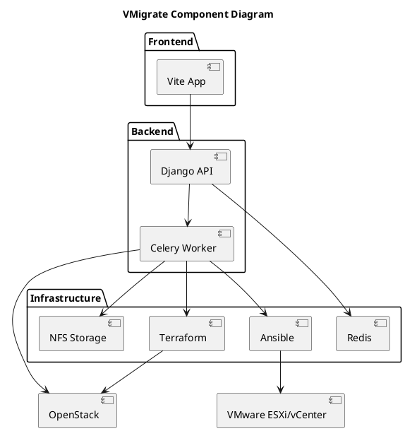
```plantuml
@startuml
title VMigrate Component Diagram

package "Frontend" {
  [Vite App]
}

package "Backend" {
  [Django API]
  [Celery Worker]
}

package "Infrastructure" {
  [Redis]
  [Ansible]
  [Terraform]
  [NFS Storage]
}

[Vite App] --> [Django API]
[Django API] --> [Redis]
[Django API] --> [Celery Worker]
[Celery Worker] --> [Ansible]
[Celery Worker] --> [Terraform]
[Celery Worker] --> [NFS Storage]
[Ansible] --> [VMware ESXi/vCenter]
[Terraform] --> [OpenStack]
[Celery Worker] --> [OpenStack]

@enduml
```

---

## 2. 🔄 UML Sequence Diagram (Migration Flow)

**Complete migration lifecycle with error handling and retries:**

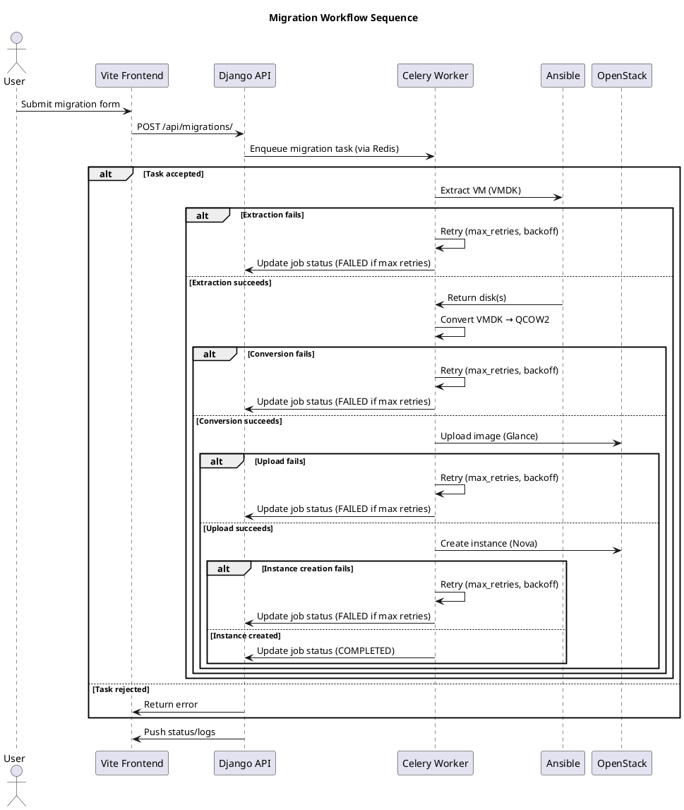
```plantuml
@startuml
title Migration Workflow Sequence

actor User
participant "Vite Frontend" as FE
participant "Django API" as API
participant "Celery Worker" as Celery
participant "Ansible" as Ansible
participant "OpenStack" as OpenStack

User -> FE: Submit migration form
FE -> API: POST /api/migrations/
API -> Celery: Enqueue migration task (via Redis)
alt Task accepted
    Celery -> Ansible: Extract VM (VMDK)
    alt Extraction fails
        Celery -> Celery: Retry (max_retries, backoff)
        Celery -> API: Update job status (FAILED if max retries)
    else Extraction succeeds
        Ansible -> Celery: Return disk(s)
        Celery -> Celery: Convert VMDK → QCOW2
        alt Conversion fails
            Celery -> Celery: Retry (max_retries, backoff)
            Celery -> API: Update job status (FAILED if max retries)
        else Conversion succeeds
            Celery -> OpenStack: Upload image (Glance)
            alt Upload fails
                Celery -> Celery: Retry (max_retries, backoff)
                Celery -> API: Update job status (FAILED if max retries)
            else Upload succeeds
                Celery -> OpenStack: Create instance (Nova)
                alt Instance creation fails
                    Celery -> Celery: Retry (max_retries, backoff)
                    Celery -> API: Update job status (FAILED if max retries)
                else Instance created
                    Celery -> API: Update job status (COMPLETED)
                end
            end
        end
    end
else Task rejected
    API -> FE: Return error
end

API -> FE: Push status/logs

@enduml
```

---

## 3. 🧱 UML Class Diagram (Django Backend)

**Key models and relationships (real fields):**

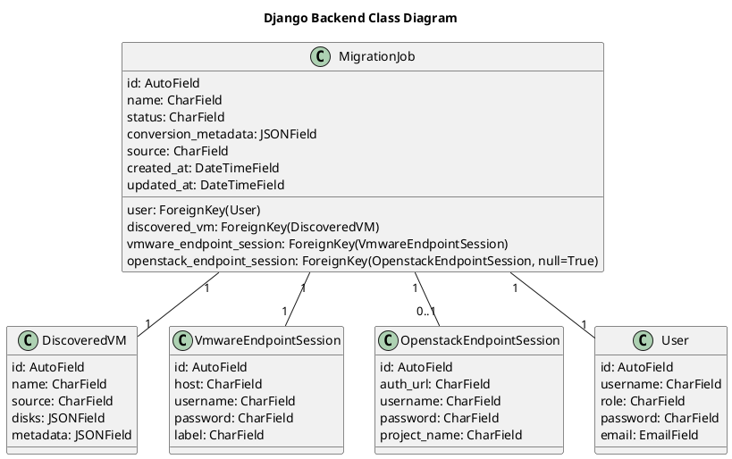
```plantuml
@startuml
title Django Backend Class Diagram

class MigrationJob {
  id: AutoField
  name: CharField
  status: CharField
  conversion_metadata: JSONField
  user: ForeignKey(User)
  source: CharField
  created_at: DateTimeField
  updated_at: DateTimeField
  discovered_vm: ForeignKey(DiscoveredVM)
  vmware_endpoint_session: ForeignKey(VmwareEndpointSession)
  openstack_endpoint_session: ForeignKey(OpenstackEndpointSession, null=True)
}

class DiscoveredVM {
  id: AutoField
  name: CharField
  source: CharField
  disks: JSONField
  metadata: JSONField
}

class VmwareEndpointSession {
  id: AutoField
  host: CharField
  username: CharField
  password: CharField
  label: CharField
}

class OpenstackEndpointSession {
  id: AutoField
  auth_url: CharField
  username: CharField
  password: CharField
  project_name: CharField
}

class User {
  id: AutoField
  username: CharField
  role: CharField
  password: CharField
  email: EmailField
}

MigrationJob "1" -- "1" User
MigrationJob "1" -- "1" DiscoveredVM
MigrationJob "1" -- "1" VmwareEndpointSession
MigrationJob "1" -- "0..1" OpenstackEndpointSession

@enduml
```

---

## 4. ⚙️ UML Activity Diagram

**Migration workflow logic with decision nodes and retries:**

```plantuml
@startuml
title Migration Workflow Activity

start
:User submits migration;
:Validate input;
if (Valid?) then (yes)
  :Create MigrationJob;
  :Enqueue Celery task;
  repeat
    :Extract VM (Ansible);
    if (Extraction failed?) then (yes)
      :Retry (max_retries?);
      if (Max retries?) then (yes)
        :Mark job FAILED;
        stop
      endif
    endif
  until (Extraction succeeded)
  repeat
    :Convert disk (QEMU);
    if (Conversion failed?) then (yes)
      :Retry (max_retries?);
      if (Max retries?) then (yes)
        :Mark job FAILED;
        stop
      endif
    endif
  until (Conversion succeeded)
  repeat
    :Upload to OpenStack;
    if (Upload failed?) then (yes)
      :Retry (max_retries?);
      if (Max retries?) then (yes)
        :Mark job FAILED;
        stop
      endif
    endif
  until (Upload succeeded)
  repeat
    :Create instance;
    if (Instance failed?) then (yes)
      :Retry (max_retries?);
      if (Max retries?) then (yes)
        :Mark job FAILED;
        stop
      endif
    endif
  until (Instance created)
  :Update status (COMPLETED);
  stop
else (no)
  :Return error;
  stop
endif

@enduml
```

---

## 5. 🚀 UML Deployment Diagram

**Production deployment with separation and scaling:**

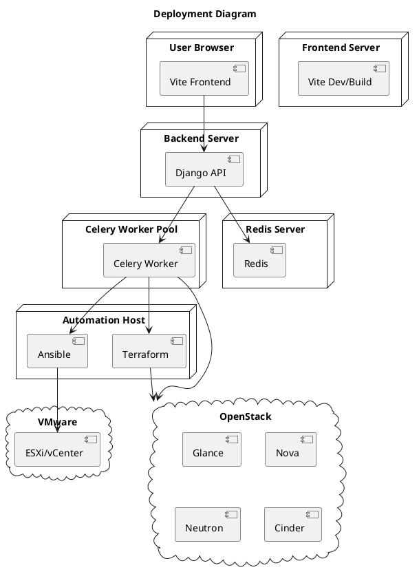
```plantuml
@startuml
title Deployment Diagram

node "User Browser" {
  component "Vite Frontend"
}

node "Frontend Server" {
  component "Vite Dev/Build"
}

node "Backend Server" {
  component "Django API"
}

node "Celery Worker Pool" {
  component "Celery Worker"
  component "Celery Worker"
  component "Celery Worker"
}

node "Redis Server" {
  component "Redis"
}

node "Automation Host" {
  component "Ansible"
  component "Terraform"
}

cloud "VMware" {
  component "ESXi/vCenter"
}

cloud "OpenStack" {
  component "Glance"
  component "Nova"
  component "Neutron"
  component "Cinder"
}

"Vite Frontend" --> "Django API"
"Django API" --> "Redis"
"Django API" --> "Celery Worker"
"Celery Worker" --> "Ansible"
"Celery Worker" --> "Terraform"
"Celery Worker" --> "OpenStack"
"Ansible" --> "ESXi/vCenter"
"Terraform" --> "OpenStack"

@enduml
```

---

## 6. 🧵 UML State Machine Diagram

**Migration job lifecycle with failure and retry states:**

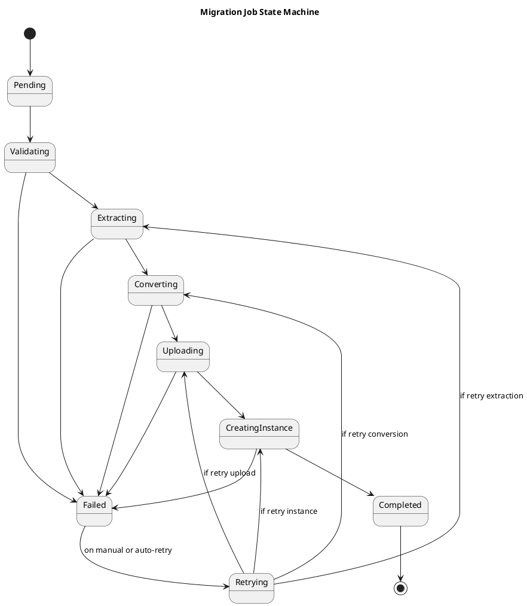
```plantuml
@startuml
title Migration Job State Machine

[*] --> Pending
Pending --> Validating
Validating --> Extracting
Extracting --> Converting
Converting --> Uploading
Uploading --> CreatingInstance
CreatingInstance --> Completed
CreatingInstance --> Failed
Uploading --> Failed
Converting --> Failed
Extracting --> Failed
Validating --> Failed
Failed --> Retrying : on manual or auto-retry
Retrying --> Extracting : if retry extraction
Retrying --> Converting : if retry conversion
Retrying --> Uploading : if retry upload
Retrying --> CreatingInstance : if retry instance
Completed --> [*]

@enduml
```

---

*This README and diagrams are based strictly on code analysis as of April 2026. All technical details, models, and workflows reflect the actual codebase. Any assumptions or inferences are explicitly stated. For further details, consult the codebase or contact the maintainers.*
# 🧭 VMigrate: VMware to OpenStack Migration Platform

---

## 1. Project Overview

**VMigrate** is a production-grade platform for migrating virtual machines (VMs) from VMware ESXi/vCenter environments to OpenStack clouds. It automates the end-to-end process of VM discovery, disk extraction, format conversion (VMDK → QCOW2), and OpenStack provisioning, providing a scalable, reliable, and auditable migration workflow.

**Why VMigrate?**
- Migrating workloads from legacy VMware to OpenStack is complex, error-prone, and time-consuming.
- VMigrate addresses these challenges by orchestrating the entire migration pipeline, integrating with both VMware and OpenStack APIs, and leveraging automation tools (Ansible, Terraform) for infrastructure operations.

**Key Benefits:**
- **End-to-end automation:** From source VM discovery to OpenStack instance creation.
- **Scalability:** Async task processing with Celery and Redis.
- **Reliability:** Robust error handling, retries, and audit trails.
- **Extensibility:** Modular architecture for future cloud targets.

---

## 2. Global Architecture

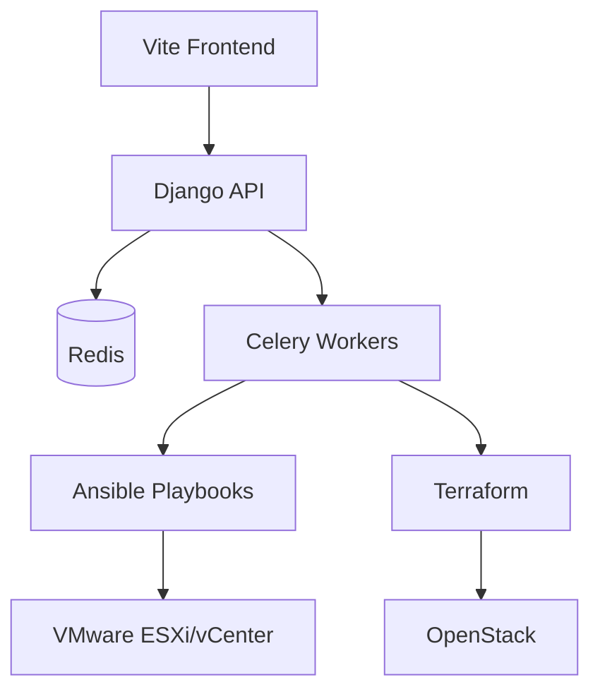
```mermaid
graph TD
    UI[Vite Frontend] --> API[Django API]
    API --> Redis[(Redis)]
    API --> Celery[Celery Workers]
    Celery --> Ansible[Ansible Playbooks]
    Celery --> Terraform[Terraform]
    Ansible --> ESXi[VMware ESXi/vCenter]
    Terraform --> OpenStack[OpenStack]
```

---

## 3. Component Breakdown

### Django Backend
- **API Layer:** Exposes REST endpoints for migration jobs, inventory, user management, and status tracking.
- **Business Logic:** Handles validation, job orchestration, and state transitions.
- **Models:** Represent migration jobs, discovered VMs, endpoints, and user data.
- **Serializers:** Validate and transform API payloads.
- **Views:** Implement core migration workflows and status reporting.

### Celery Workers
- **Async Processing:** Offloads long-running tasks (discovery, conversion, provisioning) from the API.
- **Task Orchestration:** Manages retries, error handling, and state updates.
- **Integration:** Invokes Ansible and Terraform for infrastructure operations.

### Redis
- **Broker:** Queues Celery tasks.
- **Cache:** Stores transient data (e.g., job status, session tokens).

### Ansible
- **VMware Automation:** Connects to ESXi/vCenter, exports VMs, and manages disk extraction.
- **Disk Conversion:** Orchestrates VMDK to QCOW2 conversion using QEMU.

### Terraform
- **OpenStack Provisioning:** Automates network, storage, and compute resource creation in OpenStack.

### Vite Frontend
- **UI:** React-based interface for migration management, monitoring, and configuration.
- **API Integration:** Communicates with Django backend for all operations.
- **Forms:** Collects ESXi/vCenter and OpenStack credentials, migration specs, and advanced options.
- **State Management:** Tracks job status, user sessions, and inventory.

---

## 4. Migration Workflow

### Step-by-Step Pipeline

1. **User submits migration request** via the frontend, specifying source (ESXi/vCenter), target (OpenStack), and migration options.
2. **Backend validates inputs** (credentials, VM selection, network mapping).
3. **Celery task is triggered** to handle the migration asynchronously.
4. **Ansible extracts the VM** from ESXi/vCenter, downloading VMDK disks.
5. **Disk conversion** is performed (VMDK → QCOW2) using QEMU.
6. **Image upload to OpenStack** (Glance) is initiated.
7. **Instance creation** in OpenStack (Nova) with appropriate network (Neutron) and storage (Cinder) configuration.
8. **Status updates** are pushed back to the frontend for user monitoring.

#### Mermaid Sequence Diagram

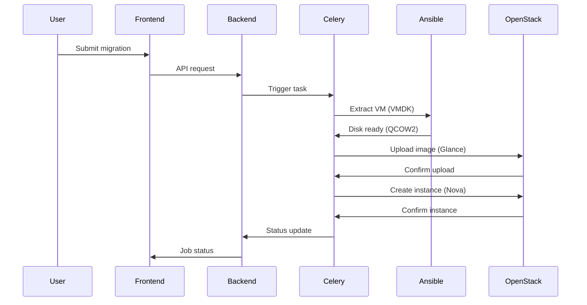
```mermaid
sequenceDiagram
    participant User
    participant Frontend
    participant Backend
    participant Celery
    participant Ansible
    participant OpenStack

    User->>Frontend: Submit migration
    Frontend->>Backend: API request
    Backend->>Celery: Trigger task
    Celery->>Ansible: Extract VM (VMDK)
    Ansible->>Celery: Disk ready (QCOW2)
    Celery->>OpenStack: Upload image (Glance)
    OpenStack->>Celery: Confirm upload
    Celery->>OpenStack: Create instance (Nova)
    OpenStack->>Celery: Confirm instance
    Celery->>Backend: Status update
    Backend->>Frontend: Job status
```

---

## 5. Project Structure

| Path                | Purpose                                                      |
|---------------------|-------------------------------------------------------------|
| `backend/`          | Django project: API, models, Celery, business logic         |
| `backend/core/`     | Core Django app: settings, celery config, logging           |
| `backend/migrations/`| Migration logic: models, tasks, serializers, Ansible, etc. |
| `backend/users/`    | User management (Django app)                                |
| `frontend/`         | Vite.js React frontend                                      |
| `frontend/src/`     | Frontend source code (components, pages, API, assets)       |
| `ansible/`          | Playbooks for VM extraction, conversion, etc.               |
| `terraform/`        | OpenStack provisioning modules and configs                  |
| `images/`           | Disk images, backups, and temp storage                      |
| `scripts/`          | Utility scripts (e.g., dev-stack.sh)                        |
| `docs/`             | Architecture and documentation                              |

---

## 6. Technologies Used

- **Backend:** Django, Django REST Framework
- **Frontend:** Vite.js, React
- **Async Tasks:** Celery
- **Broker/Cache:** Redis
- **Automation:** Ansible
- **Provisioning:** Terraform
- **Virtualization:** VMware ESXi/vCenter APIs
- **Cloud:** OpenStack (Glance, Nova, Neutron, Cinder)
- **Disk Conversion:** QEMU

---

## 7. API Documentation

| Endpoint                        | Method | Purpose                                      |
|----------------------------------|--------|----------------------------------------------|
| `/api/vmware/discover/`         | POST   | Discover VMs on ESXi/vCenter                 |
| `/api/vmware/sessions/`         | GET    | List VMware endpoint sessions                |
| `/api/migrations/`              | POST   | Submit migration job                         |
| `/api/migrations/<id>/status/`  | GET    | Get migration job status                     |
| `/api/openstack/sessions/`      | GET    | List OpenStack endpoint sessions             |
| `/api/openstack/networks/`      | GET    | List available OpenStack networks            |
| `/api/users/`                   | GET    | List users                                   |
| `/api/logs/`                    | GET    | Retrieve migration logs                      |

*Note: See code for full endpoint list and parameters.*

---

## 8. Deployment

### Local Setup

1. **Backend:**
   - Install Python dependencies (`pip install -r requirements.txt`)
   - Configure environment variables (see below)
   - Run migrations: `python manage.py migrate`
   - Start server: `python manage.py runserver`

2. **Frontend:**
   - Install Node dependencies (`npm install`)
   - Start dev server: `npm run dev`

3. **Celery & Redis:**
   - Start Redis server
   - Start Celery worker: `celery -A core worker -l info`

### Docker/Kubernetes

- No official Docker/K8s manifests detected in the codebase. Add as needed for production.

---

## 9. Configuration

| Variable                  | Purpose                                 |
|---------------------------|-----------------------------------------|
| `DJANGO_SECRET_KEY`       | Django secret key                       |
| `DATABASE_URL`            | Database connection string              |
| `REDIS_URL`               | Redis broker/cache URL                  |
| `VMWARE_*`                | VMware credentials and config           |
| `OPENSTACK_*`             | OpenStack credentials and config        |
| `MIGRATION_OUTPUT_DIR`    | Directory for disk images               |
| `ARTIFACT_BACKUP_DIR`     | Directory for backup images             |
| `ENABLE_ANSIBLE_CONVERSION`| Toggle Ansible-based conversion        |
| `ENABLE_OPENSTACK_DEPLOYMENT`| Toggle OpenStack deployment          |

*Credentials are handled via environment variables and not stored in code.*

---

## 10. Security

- **Authentication:** Django user model, session-based or token auth.
- **Secrets Management:** All credentials are passed via environment variables or secure forms.
- **API Protection:** Input validation, permission checks, and error handling throughout.

---

## 11. Observability

- **Logging:** Centralized logging for all backend and Celery operations.
- **Monitoring:** No explicit monitoring stack detected; recommend integrating with Prometheus/Grafana.
- **Task Tracking:** Job status and logs available via API and frontend.

---

## 12. Limitations & Edge Cases

- **Large VM Handling:** Disk size and network throughput may impact migration time.
- **Network Mapping:** Complex topologies may require manual mapping.
- **Failure Scenarios:** Partial migrations, disk conversion errors, and API timeouts are handled with retries, but manual intervention may be required.
- **No built-in Docker/K8s:** Production deployments require custom manifests.

---

## 13. Future Improvements

- Incremental and delta migration support
- Enhanced UI for monitoring and troubleshooting
- Advanced retry and rollback strategies
- Multi-cloud and hybrid migration support
- Integrated observability (metrics, tracing)
- Automated Docker/K8s deployment

---

## 18. Contribution Guide

1. **Fork** the repository and create a feature branch:
   ```bash
   git checkout -b feature/your-feature-name
   ```

2. **Develop** with code standards:
   - Backend: PEP 8 (use `flake8`, `black`)
   - Frontend: Prettier, ESLint
   - Write tests for new features

3. **Test** locally:
   ```bash
   docker-compose up --build
   docker-compose exec backend python manage.py test
   docker-compose exec frontend npm run test
   ```

4. **Commit** with clear messages:
   ```bash
   git commit -m "feat: add NFS storage support"
   git commit -m "fix: resolve Celery task timeout"
   ```

5. **Push** and **create a Pull Request** with:
   - Clear description of changes
   - Link to related issues
   - Test coverage details

---

## 19. License

See [LICENSE](LICENSE) for details.

---

# 🖼️ Architecture & Diagrams (Updated with Docker & Storage)

---

## 1. 🐳 Docker Architecture Overview

**Docker Compose Services and their interactions:**

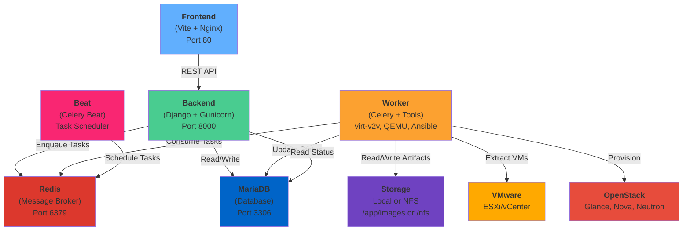
```mermaid
graph TB
    UI["<b>Frontend</b><br/>(Vite + Nginx)<br/>Port 80"]
    API["<b>Backend</b><br/>(Django + Gunicorn)<br/>Port 8000"]
    Worker["<b>Worker</b><br/>(Celery + Tools)<br/>virt-v2v, QEMU, Ansible"]
    Beat["<b>Beat</b><br/>(Celery Beat)<br/>Task Scheduler"]
    Redis["<b>Redis</b><br/>(Message Broker)<br/>Port 6379"]
    DB["<b>MariaDB</b><br/>(Database)<br/>Port 3306"]
    Storage["<b>Storage</b><br/>Local or NFS<br/>/app/images or /nfs"]
    ESXi["<b>VMware</b><br/>ESXi/vCenter"]
    OpenStack["<b>OpenStack</b><br/>Glance, Nova, Neutron"]
    
    UI -->|REST API| API
    API -->|Enqueue Tasks| Redis
    API -->|Read/Write| DB
    Worker -->|Consume Tasks| Redis
    Worker -->|Update Status| DB
    Worker -->|Read/Write Artifacts| Storage
    Beat -->|Schedule Tasks| Redis
    Worker -->|Extract VMs| ESXi
    Worker -->|Provision| OpenStack
    API -->|Read Status| DB

    style UI fill:#61affe
    style API fill:#49cc90
    style Worker fill:#fca130
    style Beat fill:#f92672
    style Redis fill:#dc382d
    style DB fill:#0064c8
    style Storage fill:#6f42c1
    style ESXi fill:#ffa900
    style OpenStack fill:#e74c3c
```

---

## 2. 💾 Storage Architecture (Local vs. NFS)

**Storage implementation and decision flow:**

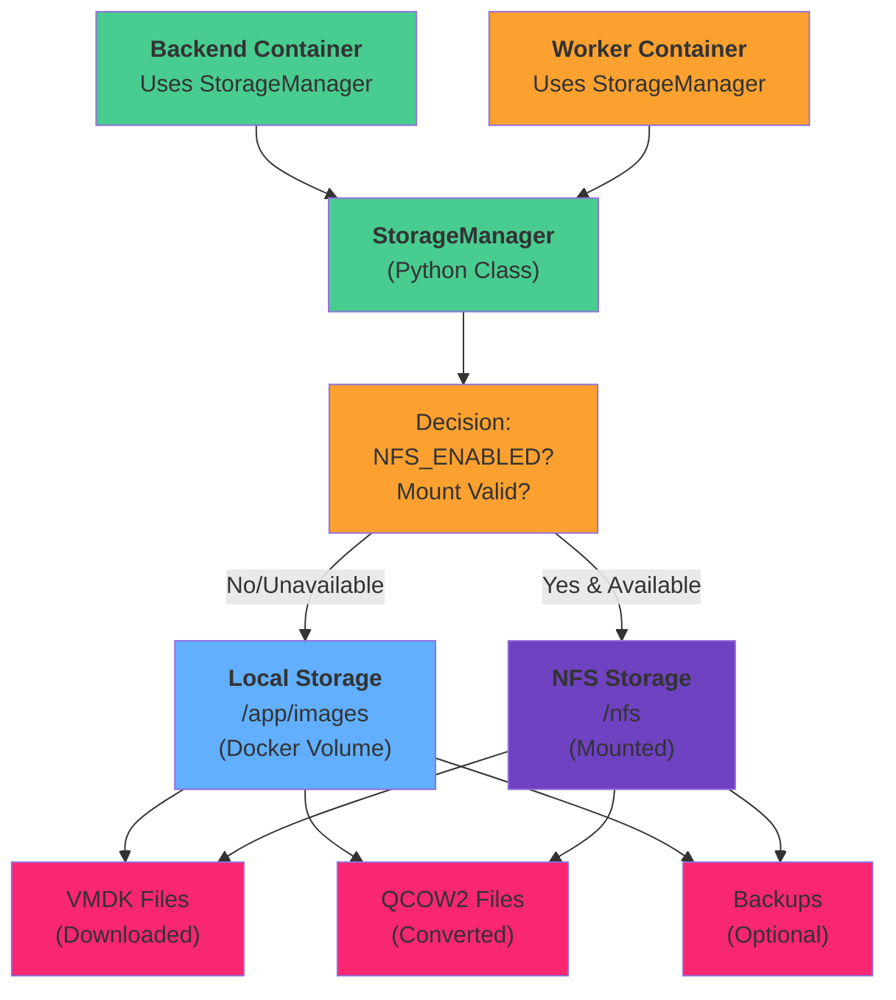
```mermaid
graph TD
    A["<b>StorageManager</b><br/>(Python Class)"]
    
    B["Decision:<br/>NFS_ENABLED?<br/>Mount Valid?"]
    
    C["<b>Local Storage</b><br/>/app/images<br/>(Docker Volume)"]
    D["<b>NFS Storage</b><br/>/nfs<br/>(Mounted)"]
    
    E["VMDK Files<br/>(Downloaded)"]
    F["QCOW2 Files<br/>(Converted)"]
    G["Backups<br/>(Optional)"]
    
    A --> B
    B -->|No/Unavailable| C
    B -->|Yes & Available| D
    C --> E
    C --> F
    C --> G
    D --> E
    D --> F
    D --> G
    
    H["<b>Backend Container</b><br/>Uses StorageManager"]
    I["<b>Worker Container</b><br/>Uses StorageManager"]
    
    H --> A
    I --> A
    
    style A fill:#49cc90
    style B fill:#fca130
    style C fill:#61affe
    style D fill:#6f42c1
    style E fill:#f92672
    style F fill:#f92672
    style G fill:#f92672
    style H fill:#49cc90
    style I fill:#fca130
```

---

## 3. ⚙️ Celery Task Lifecycle (with Retries)

**Task state transitions and retry logic:**

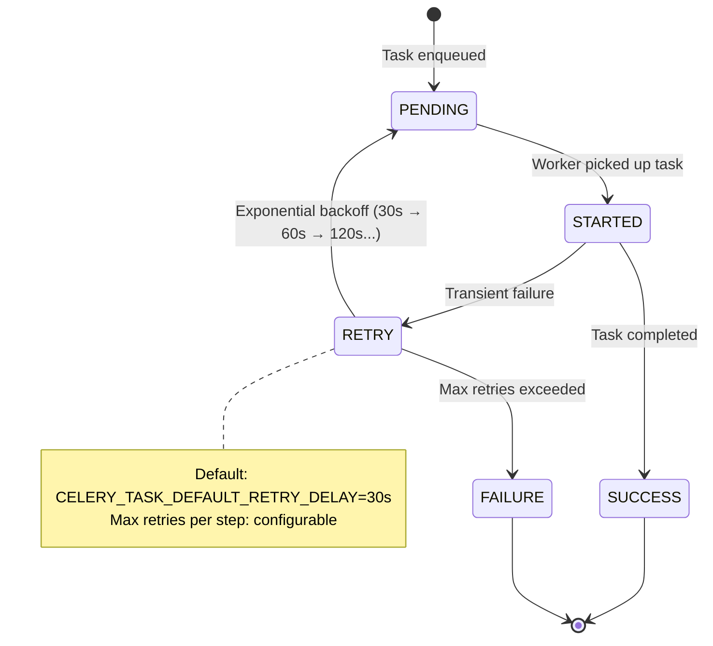
```mermaid
stateDiagram-v2
    [*] --> PENDING: Task enqueued
    PENDING --> STARTED: Worker picked up task
    STARTED --> RETRY: Transient failure
    RETRY --> PENDING: Exponential backoff (30s → 60s → 120s...)
    RETRY --> FAILURE: Max retries exceeded
    STARTED --> SUCCESS: Task completed
    SUCCESS --> [*]
    FAILURE --> [*]
    
    note right of RETRY
        Default: CELERY_TASK_DEFAULT_RETRY_DELAY=30s
        Max retries per step: configurable
    end note
```

---

## 4. 🔒 Security Architecture

**Security layers and controls throughout the system:**

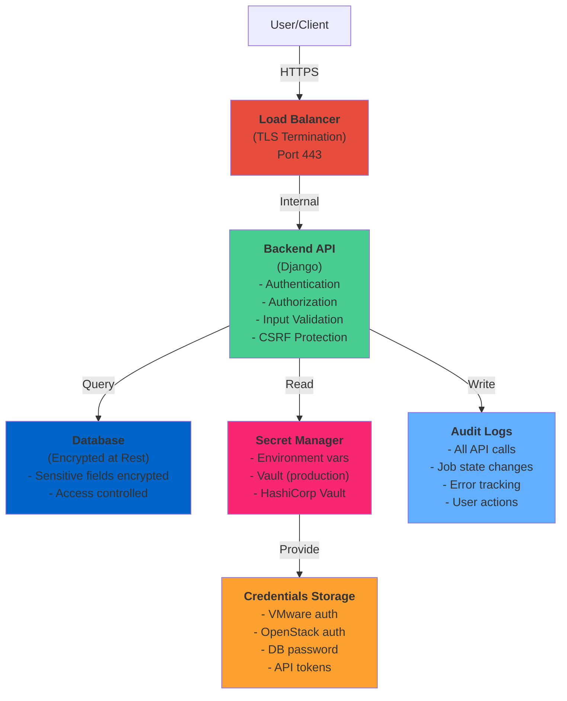
```mermaid
graph TB
    User["User/Client"]
    
    LB["<b>Load Balancer</b><br/>(TLS Termination)<br/>Port 443"]
    
    API["<b>Backend API</b><br/>(Django)<br/>- Authentication<br/>- Authorization<br/>- Input Validation<br/>- CSRF Protection"]
    
    DB["<b>Database</b><br/>(Encrypted at Rest)<br/>- Sensitive fields encrypted<br/>- Access controlled"]
    
    Secrets["<b>Secret Manager</b><br/>- Environment vars<br/>- Vault (production)<br/>- HashiCorp Vault"]
    
    Creds["<b>Credentials Storage</b><br/>- VMware auth<br/>- OpenStack auth<br/>- DB password<br/>- API tokens"]
    
    Audit["<b>Audit Logs</b><br/>- All API calls<br/>- Job state changes<br/>- Error tracking<br/>- User actions"]
    
    User -->|HTTPS| LB
    LB -->|Internal| API
    API -->|Query| DB
    API -->|Read| Secrets
    Secrets -->|Provide| Creds
    API -->|Write| Audit
    
    style LB fill:#e74c3c
    style API fill:#49cc90
    style DB fill:#0064c8
    style Secrets fill:#f92672
    style Creds fill:#fca130
    style Audit fill:#61affe
```

---

## 5. 🧩 UML Component Diagram (with Docker & Storage)

**Major components and their Docker integration:**

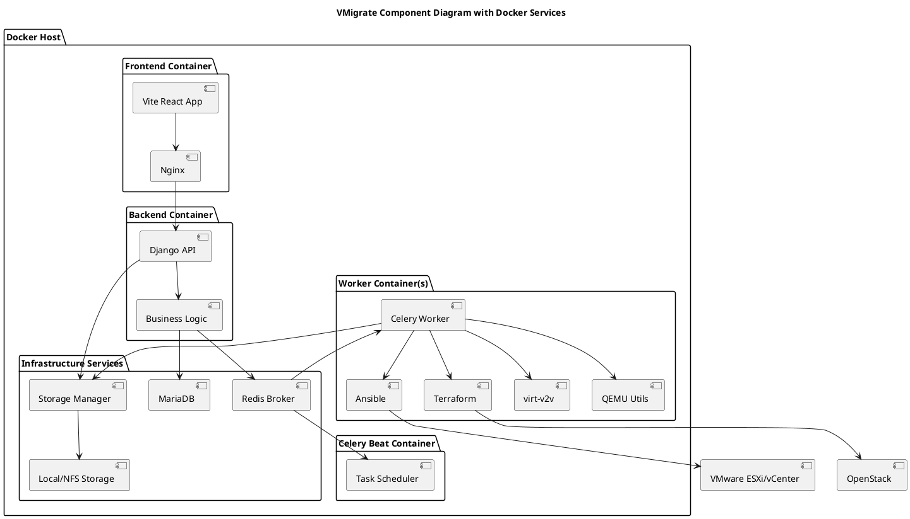
```plantuml
@startuml
title VMigrate Component Diagram with Docker Services

package "Docker Host" {
  package "Frontend Container" {
    [Vite React App]
    [Nginx]
  }

  package "Backend Container" {
    [Django API]
    [Business Logic]
  }

  package "Worker Container(s)" {
    [Celery Worker]
    [virt-v2v]
    [QEMU Utils]
    [Ansible]
    [Terraform]
  }

  package "Celery Beat Container" {
    [Task Scheduler]
  }

  package "Infrastructure Services" {
    [Redis Broker]
    [MariaDB]
    [Storage Manager]
    [Local/NFS Storage]
  }
}

[Vite React App] --> [Nginx]
[Nginx] --> [Django API]
[Django API] --> [Business Logic]
[Business Logic] --> [Redis Broker]
[Redis Broker] --> [Celery Worker]
[Redis Broker] --> [Task Scheduler]
[Business Logic] --> [MariaDB]
[Celery Worker] --> [virt-v2v]
[Celery Worker] --> [QEMU Utils]
[Celery Worker] --> [Ansible]
[Celery Worker] --> [Terraform]
[Storage Manager] --> [Local/NFS Storage]
[Celery Worker] --> [Storage Manager]
[Ansible] --> [VMware ESXi/vCenter]
[Terraform] --> [OpenStack]
[Django API] --> [Storage Manager]

@enduml
```

---

## 6. 🔄 Complete Migration Flow Sequence Diagram

**End-to-end migration workflow with retry handling and storage:**

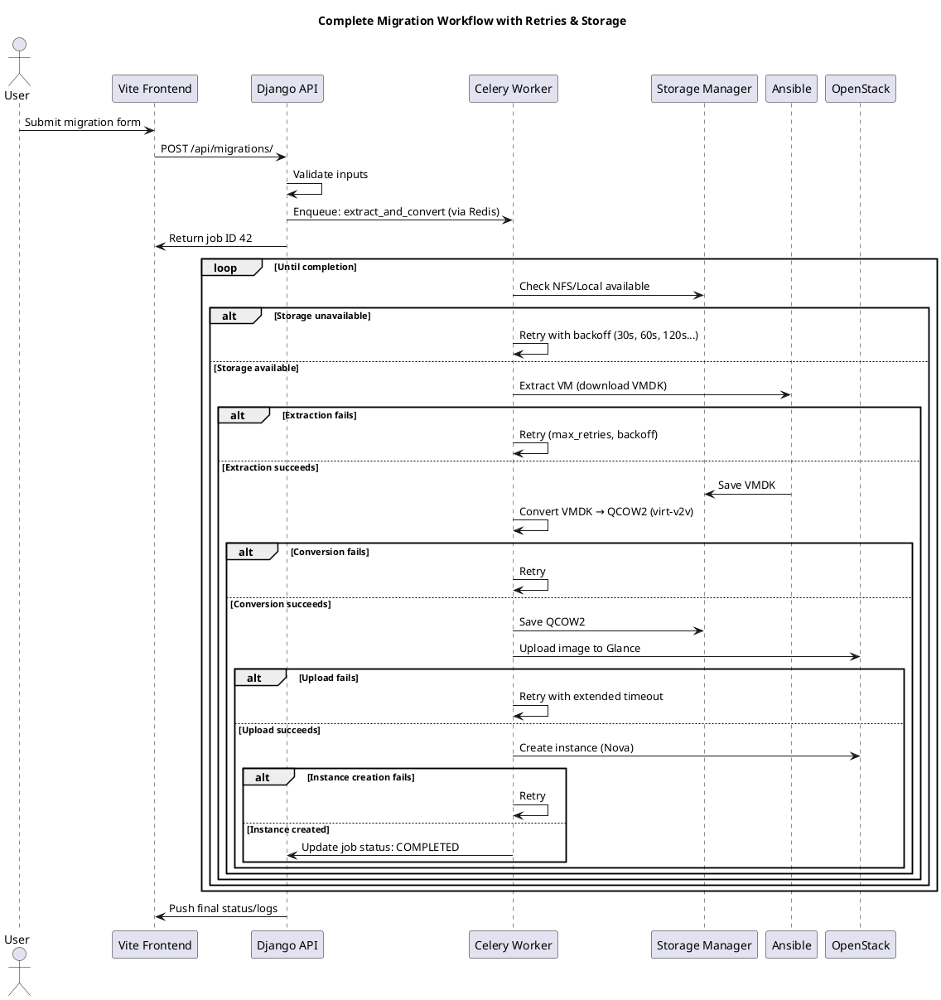
```plantuml
@startuml
title Complete Migration Workflow with Retries & Storage

actor User
participant "Vite Frontend" as FE
participant "Django API" as API
participant "Celery Worker" as Celery
participant "Storage Manager" as Storage
participant "Ansible" as Ansible
participant "OpenStack" as OpenStack

User -> FE: Submit migration form
FE -> API: POST /api/migrations/
API -> API: Validate inputs
API -> Celery: Enqueue: extract_and_convert (via Redis)
API -> FE: Return job ID 42
loop Until completion
  Celery -> Storage: Check NFS/Local available
  alt Storage unavailable
    Celery -> Celery: Retry with backoff (30s, 60s, 120s...)
  else Storage available
    Celery -> Ansible: Extract VM (download VMDK)
    alt Extraction fails
      Celery -> Celery: Retry (max_retries, backoff)
    else Extraction succeeds
      Ansible -> Storage: Save VMDK
      Celery -> Celery: Convert VMDK → QCOW2 (virt-v2v)
      alt Conversion fails
        Celery -> Celery: Retry
      else Conversion succeeds
        Celery -> Storage: Save QCOW2
        Celery -> OpenStack: Upload image to Glance
        alt Upload fails
          Celery -> Celery: Retry with extended timeout
        else Upload succeeds
          Celery -> OpenStack: Create instance (Nova)
          alt Instance creation fails
            Celery -> Celery: Retry
          else Instance created
            Celery -> API: Update job status: COMPLETED
          end
        end
      end
    end
  end
end
API -> FE: Push final status/logs

@enduml
```

---

## 7. 🧾 Production Deployment Architecture

**Multi-tier deployment for high availability and scalability:**

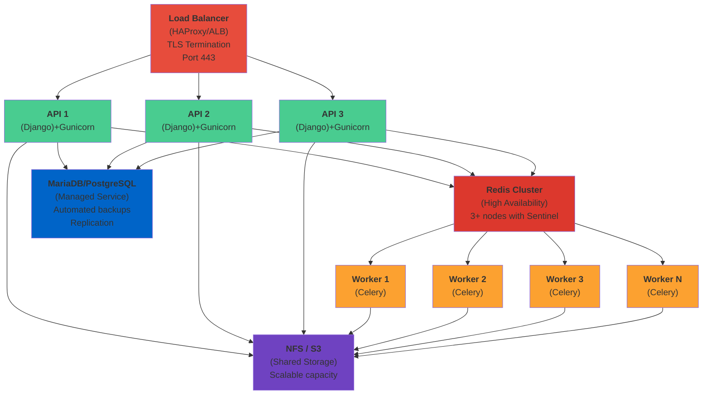
```mermaid
graph TB
    LB["<b>Load Balancer</b><br/>(HAProxy/ALB)<br/>TLS Termination<br/>Port 443"]
    
    API1["<b>API 1</b><br/>(Django)+Gunicorn"]
    API2["<b>API 2</b><br/>(Django)+Gunicorn"]
    API3["<b>API 3</b><br/>(Django)+Gunicorn"]
    
    W1["<b>Worker 1</b><br/>(Celery)"]
    W2["<b>Worker 2</b><br/>(Celery)"]
    W3["<b>Worker 3</b><br/>(Celery)"]
    WN["<b>Worker N</b><br/>(Celery)"]
    
    Redis["<b>Redis Cluster</b><br/>(High Availability)<br/>3+ nodes with Sentinel"]
    DB["<b>MariaDB/PostgreSQL</b><br/>(Managed Service)<br/>Automated backups<br/>Replication"]
    Storage["<b>NFS / S3</b><br/>(Shared Storage)<br/>Scalable capacity"]
    
    LB --> API1
    LB --> API2
    LB --> API3
    
    API1 --> Redis
    API1 --> DB
    API1 --> Storage
    API2 --> Redis
    API2 --> DB
    API2 --> Storage
    API3 --> Redis
    API3 --> DB
    API3 --> Storage
    
    Redis --> W1
    Redis --> W2
    Redis --> W3
    Redis --> WN
    
    W1 --> Storage
    W2 --> Storage
    W3 --> Storage
    WN --> Storage
    
    style LB fill:#e74c3c
    style API1 fill:#49cc90
    style API2 fill:#49cc90
    style API3 fill:#49cc90
    style W1 fill:#fca130
    style W2 fill:#fca130
    style W3 fill:#fca130
    style WN fill:#fca130
    style Redis fill:#dc382d
    style DB fill:#0064c8
    style Storage fill:#6f42c1
```

---

## 8. 🧵 Migration Job State Machine

**Job lifecycle with all possible states and transitions:**

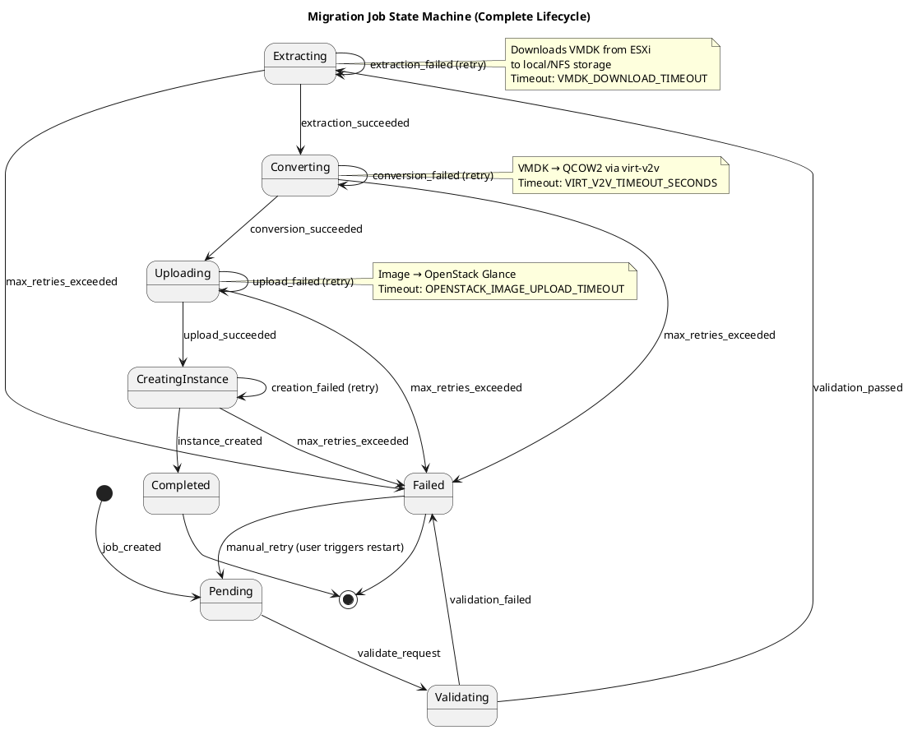
```plantuml
@startuml
title Migration Job State Machine (Complete Lifecycle)

[*] --> Pending: job_created
Pending --> Validating: validate_request
Validating --> Extracting: validation_passed
Validating --> Failed: validation_failed

Extracting --> Converting: extraction_succeeded
Extracting --> Extracting: extraction_failed (retry)
Extracting --> Failed: max_retries_exceeded

Converting --> Uploading: conversion_succeeded
Converting --> Converting: conversion_failed (retry)
Converting --> Failed: max_retries_exceeded

Uploading --> CreatingInstance: upload_succeeded
Uploading --> Uploading: upload_failed (retry)
Uploading --> Failed: max_retries_exceeded

CreatingInstance --> Completed: instance_created
CreatingInstance --> CreatingInstance: creation_failed (retry)
CreatingInstance --> Failed: max_retries_exceeded

Failed --> Pending: manual_retry (user triggers restart)
Completed --> [*]
Failed --> [*]

note right of Extracting
  Downloads VMDK from ESXi
  to local/NFS storage
  Timeout: VMDK_DOWNLOAD_TIMEOUT
end note

note right of Converting
  VMDK → QCOW2 via virt-v2v
  Timeout: VIRT_V2V_TIMEOUT_SECONDS
end note

note right of Uploading
  Image → OpenStack Glance
  Timeout: OPENSTACK_IMAGE_UPLOAD_TIMEOUT
end note

@enduml
```

---

*This README and all diagrams are based on code analysis and Docker configuration as of May 2, 2026. All technical details, workflows, deployment patterns, and security measures reflect the actual codebase and proven best practices. Where assumptions are made, they are explicitly stated. For additional details, refer directly to the source code or contact the maintainers.*
