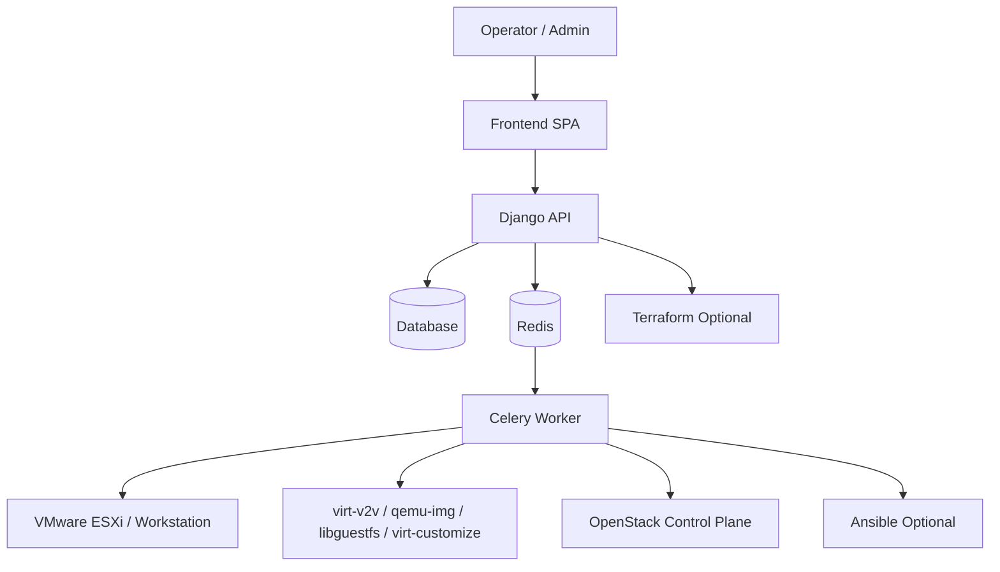
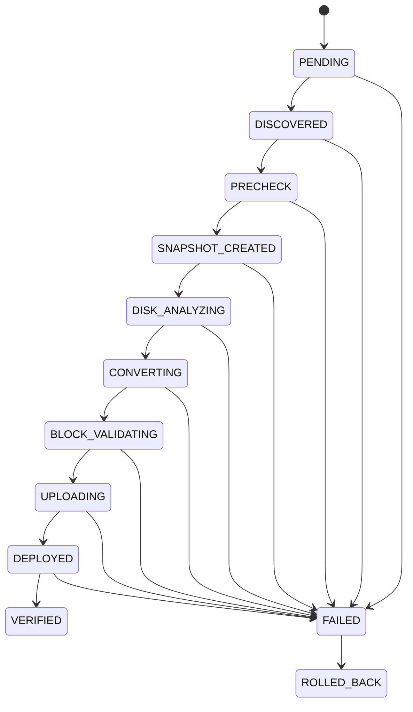
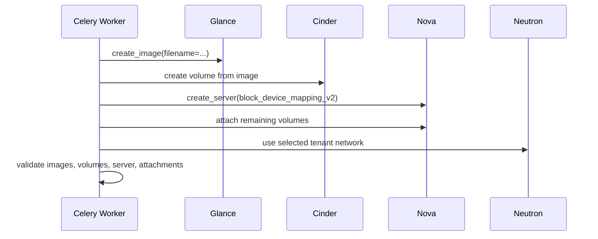
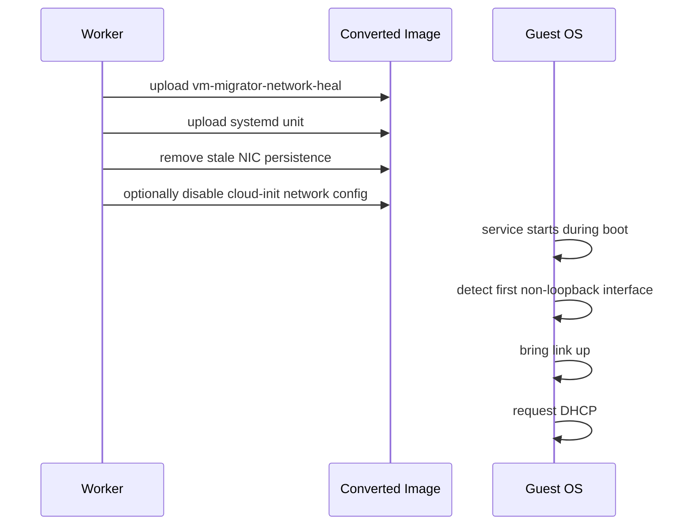
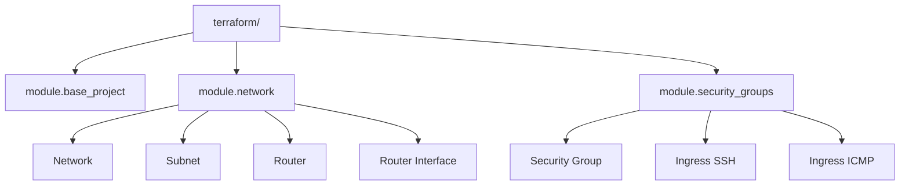

# VM Migrator Architecture

This document is the architecture-focused companion to the root [README.md](/home/amin/Desktop/vm-migrator/README.md). It is intended for maintainers, platform engineers, and anyone who needs a code-aligned view of how the system is structured and how the migration pipeline works.

## System Overview

VM Migrator is an orchestration platform for moving VMware workloads to OpenStack. It combines:
- a Django REST API for operator-facing workflows
- Celery workers for long-running execution
- Redis for broker and result transport
- virtualization toolchains for disk conversion and validation
- OpenStack SDK integrations for upload and deployment

At a high level, the platform has four concerns:
- source inventory and endpoint management
- conversion planning and execution
- target deployment into OpenStack
- rollback and operational visibility

## Topology

## Main Runtime Components

### Frontend

The React frontend handles:
- authentication
- endpoint onboarding
- inventory browsing
- migration submission
- job tracking
- OpenStack provisioning controls

### Django API

The API is responsible for:
- validating requests
- enforcing RBAC
- persisting jobs and endpoint sessions
- enqueuing long-running tasks
- surfacing health, job, and provisioning state

Relevant modules:
- [backend/migrations/views.py](/home/amin/Desktop/vm-migrator/backend/migrations/views.py)
- [backend/users/views.py](/home/amin/Desktop/vm-migrator/backend/users/views.py)

### Celery Worker

The Celery worker executes:
- migration workflows
- rollback workflows
- VMware discovery
- OpenStack provisioning tasks

The worker is where conversion tools and guest-image customization tools must exist.

Relevant modules:
- [backend/migrations/tasks.py](/home/amin/Desktop/vm-migrator/backend/migrations/tasks.py)
- [backend/core/celery.py](/home/amin/Desktop/vm-migrator/backend/core/celery.py)

### Conversion and Validation Toolchain

The worker relies on:
- `virt-v2v`
- `qemu-img`
- `virt-inspector`
- `virt-filesystems`
- `virt-df`
- `guestfish`
- `virt-customize`

These are used for:
- conversion
- artifact inspection
- block validation
- filesystem consistency checks
- guest image remediation

## Data Model

Primary persisted entities:
- `MigrationJob`
- `DiscoveredVM`
- `VmwareEndpointSession`
- `OpenstackEndpointSession`
- `OpenStackProvisioningRun`

Relevant file:
- [backend/migrations/models.py](/home/amin/Desktop/vm-migrator/backend/migrations/models.py)

## Migration State Machine

The migration workflow is modeled as a status-driven state machine.

The transition logic lives in:
- [backend/migrations/models.py](/home/amin/Desktop/vm-migrator/backend/migrations/models.py)
- [backend/migrations/tasks.py](/home/amin/Desktop/vm-migrator/backend/migrations/tasks.py)

## Migration Pipeline

### Stage Details

1. `PRECHECK`
   - validates the conversion plan
   - validates source inventory and local disk metadata

2. `SNAPSHOT_CREATED`
   - optional ESXi snapshot before migration

3. `DISK_ANALYZING`
   - evaluates disk layout and sparse-output hints

4. `CONVERTING`
   - runs `qemu-img`, `virt-v2v`, or optional Ansible-based execution

5. guest network remediation
   - modifies converted images before upload
   - injects a self-heal service into Linux guests

6. `BLOCK_VALIDATING`
   - performs `qemu-img check`-style validation
   - runs filesystem consistency checks

7. `UPLOADING`
   - uploads images to Glance
   - creates volumes
   - boots server from volume

8. `DEPLOYED` and `VERIFIED`
   - validates images, server state, flavor sizing, network presence, and volume attachments

## OpenStack Deployment Architecture

The deployment path is implemented through helper functions in:
- [backend/migrations/openstack_deployment.py](/home/amin/Desktop/vm-migrator/backend/migrations/openstack_deployment.py)

The current deployment model is:
- upload artifact to Glance
- create Cinder volume from image
- boot Nova instance from the selected boot volume
- attach remaining migrated disks
- attach optional extra blank volumes

## Guest Network Remediation Design

One of the recurring migration issues is guest interface renaming between VMware and OpenStack virtual hardware. A guest configured for a VMware-era interface like `ens33` may boot in OpenStack with a different name such as `ens3`, leaving the system unreachable.

This codebase handles that before Glance upload using:
- [backend/migrations/network_remediation.py](/home/amin/Desktop/vm-migrator/backend/migrations/network_remediation.py)

### Current Strategy

- run `virt-customize` on the converted image
- upload a boot-time shell script and systemd unit into the guest
- remove stale persistent network rules
- remove stale `HWADDR` and `UUID` bindings from `ifcfg-*` where present
- optionally disable cloud-init network rendering with `network: {config: disabled}`

### Remediation Flow

### Why This Was Chosen

- it does not depend on guest SSH access
- it does not assume cloud-init is installed
- it persists with the image and scales across repeated migrations
- it is idempotent because it exits early if networking is already healthy

## Optional Automation Paths

### Terraform

Terraform is used to provision OpenStack tenant networking and security primitives.

### Ansible

Ansible is an optional conversion execution path used instead of directly invoking local conversion commands.

Relevant files:
- [backend/migrations/ansible_runner.py](/home/amin/Desktop/vm-migrator/backend/migrations/ansible_runner.py)
- [ansible/playbooks/conversion.yml](/home/amin/Desktop/vm-migrator/ansible/playbooks/conversion.yml)

## Security and Trust Boundaries

Key trust boundaries:
- browser to API
- API to database
- API and worker to Redis
- worker to VMware
- worker and API to OpenStack
- worker to local filesystem and conversion binaries

Important implementation notes:
- credentials are stored in encrypted model fields
- most routes require JWT authentication
- regular users are scoped to their own jobs and endpoint sessions
- TLS verification can be disabled for labs, but should stay enabled in production

## Observability

Current observability features include:
- structured JSON logs
- separate app and worker log filters
- rotating log files
- task status endpoints
- health and OpenStack health APIs

Relevant files:
- [backend/core/logging.py](/home/amin/Desktop/vm-migrator/backend/core/logging.py)
- [backend/core/settings.py](/home/amin/Desktop/vm-migrator/backend/core/settings.py)

## Operational Constraints

- ESXi conversions require the source VM to be powered off
- worker hosts need sufficient local storage and CPU
- libguestfs requires readable kernel assets on the worker host
- the worker must have network reachability to VMware and OpenStack endpoints
- boot-from-volume deploy timing depends heavily on Glance and Cinder performance

## Code Navigation Map

If you are tracing behavior in the code:

- API routes: [backend/migrations/urls.py](/home/amin/Desktop/vm-migrator/backend/migrations/urls.py)
- API handlers: [backend/migrations/views.py](/home/amin/Desktop/vm-migrator/backend/migrations/views.py)
- orchestration: [backend/migrations/tasks.py](/home/amin/Desktop/vm-migrator/backend/migrations/tasks.py)
- OpenStack helpers: [backend/migrations/openstack_deployment.py](/home/amin/Desktop/vm-migrator/backend/migrations/openstack_deployment.py)
- guest remediation: [backend/migrations/network_remediation.py](/home/amin/Desktop/vm-migrator/backend/migrations/network_remediation.py)
- models and state: [backend/migrations/models.py](/home/amin/Desktop/vm-migrator/backend/migrations/models.py)
