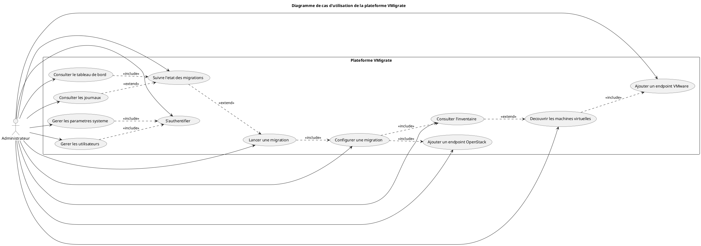
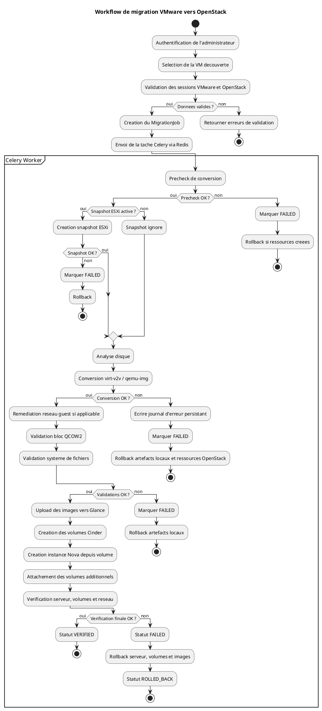
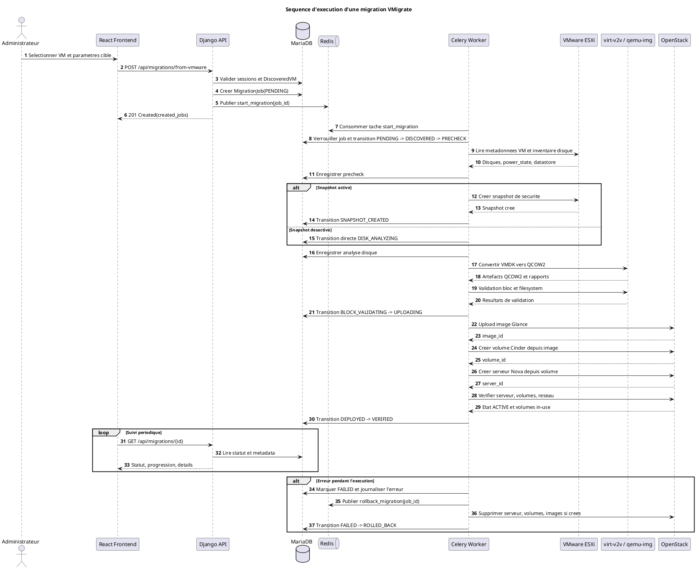
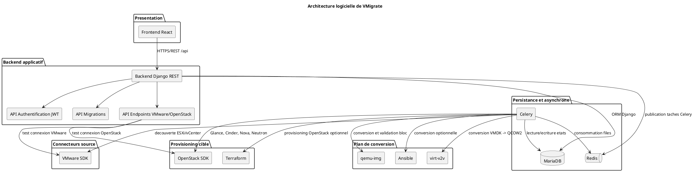
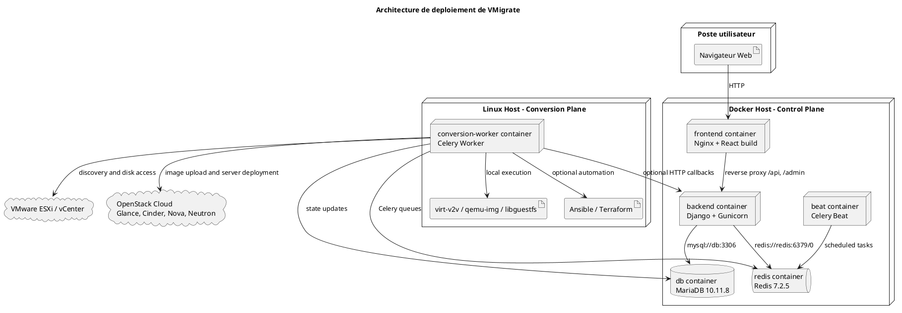
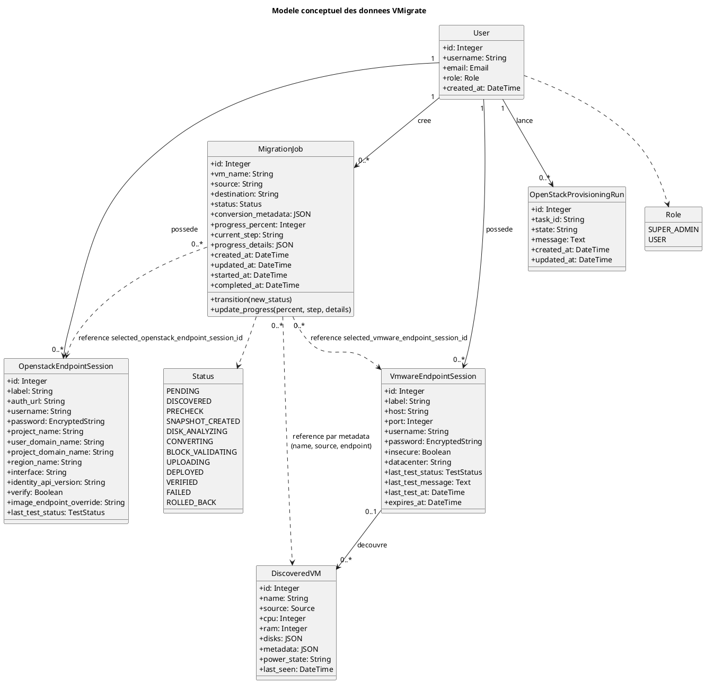
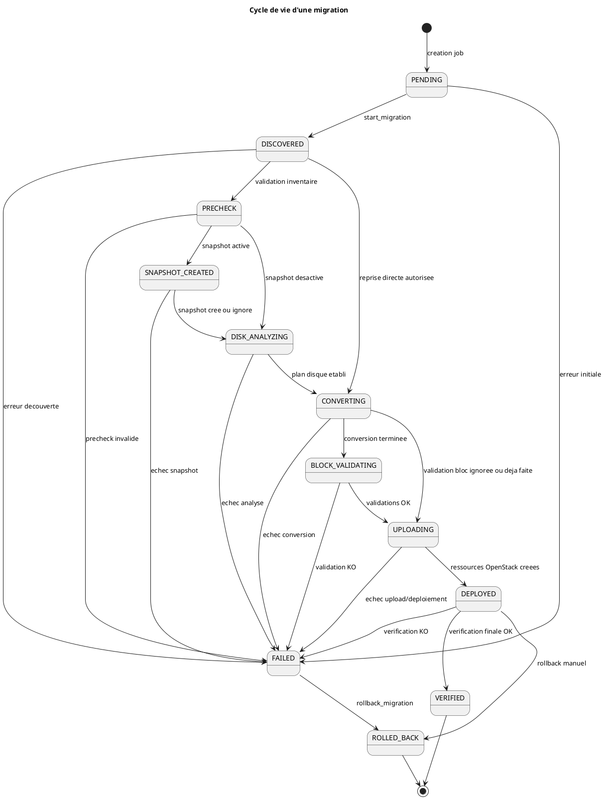
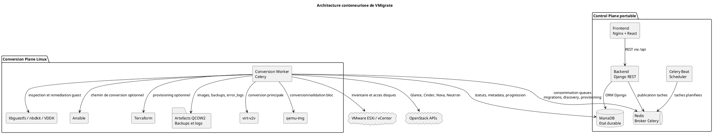
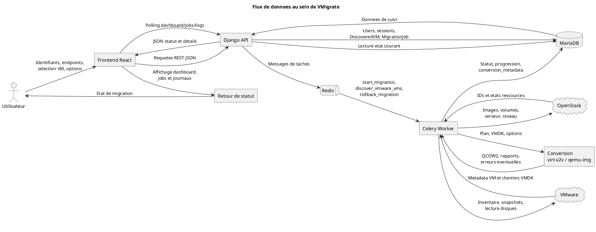

# Diagrammes UML et architecture - VMigrate

Ce document fournit les diagrammes PlantUML exploitables dans le chapitre 3 du rapport PFE. Les elements retenus proviennent du code et des documents `README.md`, `docs/architecture.md` et `docs/container-architecture.md`.

## Figure 3.1 - Diagramme de cas d'utilisation de la plateforme VMigrate

### Objectif du diagramme

Presenter les fonctionnalites visibles par l'administrateur dans la plateforme VMigrate : administration, gestion des endpoints, decouverte, orchestration de migration et supervision.

### Code PlantUML

### Description detaillee

Le diagramme represente l'administrateur comme acteur principal du systeme. Les cas d'utilisation correspondent aux modules reels exposes par le frontend React et l'API Django REST : authentification JWT, gestion des utilisateurs, endpoints VMware et OpenStack, inventaire VMware, creation de jobs de migration, suivi des statuts, journaux synthetiques et tableau de bord. Les relations `include` indiquent des dependances obligatoires, par exemple la configuration d'une migration necessite un inventaire et un endpoint OpenStack lorsque le deploiement cible est demande. Les relations `extend` indiquent des fonctions de supervision disponibles apres creation ou execution d'une migration.

### Emplacement recommande

Chapitre 3, section "Expression des besoins fonctionnels" ou "Cas d'utilisation de la solution".

### Suggestions d'amelioration UML

Ajouter ulterieurement un acteur "Operateur" si le rapport distingue les roles `SUPER_ADMIN` et `USER` implementes dans le modele `User`.

## Figure 3.2 - Workflow de migration VMware vers OpenStack

### Objectif du diagramme

Decrire le processus metier complet d'une migration depuis la validation de la demande jusqu'a la verification finale ou au rollback.

### Code PlantUML

### Description detaillee

L'activite suit l'implementation de `create_migrations_from_vmware` puis `start_migration`. L'API valide la selection VM, les sessions endpoint, les doublons et les parametres OpenStack avant de creer un `MigrationJob`. L'execution longue est ensuite confiee a Celery via Redis. Le worker effectue les etapes de precheck, snapshot optionnel, analyse disque, conversion, validation bloc/filesystem, upload OpenStack, creation Cinder/Nova et verification finale. Les branches d'erreur conduisent au statut `FAILED` et declenchent `rollback_migration` lorsque le rollback est active.

### Emplacement recommande

Chapitre 3, section "Processus metier de migration" ou "Workflow fonctionnel".

### Suggestions d'amelioration UML

Separarer ce diagramme en deux swimlanes supplementaires "API Django" et "OpenStack" si une granularite organisationnelle plus forte est souhaitee.

## Figure 3.3 - Sequence d'execution d'une migration VMigrate

### Objectif du diagramme

Montrer les interactions temporelles entre l'administrateur, le frontend, l'API, Redis, Celery, VMware, la chaine de conversion et OpenStack.

### Code PlantUML

### Description detaillee

La sequence formalise l'execution asynchrone. Le frontend ne lance pas directement les operations d'infrastructure ; il cree une demande via l'API. L'API persiste le job en base MariaDB et publie la tache Celery dans Redis. Le worker consomme la tache, execute les operations VMware et conversion, puis deploie dans OpenStack. Le retour de statut est indirect : le worker met a jour la base et le frontend interroge l'API pour afficher l'etat courant.

### Emplacement recommande

Chapitre 3, section "Architecture dynamique" ou "Scenario nominal de migration".

### Suggestions d'amelioration UML

Ajouter des messages detailles vers Glance, Cinder, Nova et Neutron dans une version annexe si le rapport doit documenter OpenStack service par service.

## Figure 3.4 - Architecture logicielle de VMigrate

### Objectif du diagramme

Representer les composants logiciels majeurs, leurs interfaces et leurs dependances internes.

### Code PlantUML

### Description detaillee

Le frontend React consomme l'API REST Django. Le backend porte les endpoints d'authentification, de gestion d'infrastructure, de migration et de supervision. MariaDB stocke les utilisateurs, sessions endpoint, VMs decouvertes, jobs et executions de provisioning. Redis sert de broker et backend de resultats Celery. Les workers Celery integrent les bibliotheques et outils d'infrastructure : VMware SDK pour la decouverte, virt-v2v/qemu-img/libguestfs pour la conversion, OpenStack SDK pour Glance/Cinder/Nova/Neutron, Ansible et Terraform pour les chemins d'automatisation presents dans le projet.

### Emplacement recommande

Chapitre 3, section "Architecture logicielle de la solution".

### Suggestions d'amelioration UML

Transformer les API internes en interfaces UML explicites si le rapport detaille les contrats REST endpoint par endpoint.

## Figure 3.5 - Architecture de deploiement de VMigrate

### Objectif du diagramme

Decrire le deploiement conteneurise reel selon `container-architecture.md`, avec un control plane portable et un conversion plane specialise.

### Code PlantUML

### Description detaillee

Le deploiement separe explicitement les responsabilites. Le control plane contient le frontend, le backend, Redis, MariaDB et Celery Beat ; il est concu pour rester portable et ne contient pas les dependances lourdes de virtualisation. Le conversion plane est un worker Linux dedie, rattache au meme reseau Docker `vm-migrator-control`, qui consomme les taches Redis et met a jour MariaDB. Cette separation isole les contraintes virt-v2v, qemu-img, libguestfs, VDDK, Ansible et Terraform du plan applicatif.

### Emplacement recommande

Chapitre 3, section "Architecture de deploiement conteneurisee".

### Suggestions d'amelioration UML

Ajouter les volumes Docker nommes si le rapport consacre une sous-section a la persistance et aux artefacts de conversion.

## Figure 3.6 - Modele conceptuel des donnees VMigrate

### Objectif du diagramme

Representer les classes metier persistantes principales et leurs relations selon les modeles Django reels.

### Code PlantUML

### Description detaillee

Le modele met en evidence les entites persistantes principales. `User` porte le role applicatif. `VmwareEndpointSession` et `OpenstackEndpointSession` conservent les parametres de connexion avec mots de passe chiffres. `DiscoveredVM` represente l'inventaire VMware decouvert. `MigrationJob` constitue l'agregat principal de suivi : statut, progression, timestamps et metadonnees de conversion. Les relations directes presentes dans les modeles sont des cles etrangeres depuis les sessions et les jobs vers l'utilisateur ; certaines associations de `MigrationJob` vers les endpoints et la VM decouverte sont stockees dans `conversion_metadata`, ce qui est represente par des dependances UML.

### Emplacement recommande

Chapitre 3, section "Modele conceptuel et persistance".

### Suggestions d'amelioration UML

Normaliser ulterieurement les references stockees dans `conversion_metadata` en cles etrangeres explicites afin de renforcer les cardinalites relationnelles.

## Figure 3.7 - Cycle de vie d'une migration

### Objectif du diagramme

Formaliser la machine d'etats du `MigrationJob` telle qu'elle est implementee dans le modele Django.

### Code PlantUML

### Description detaillee

Cette machine d'etats suit la constante `TRANSITIONS` du modele `MigrationJob`. Le statut initial est `PENDING`. Les transitions nominales vont jusqu'a `VERIFIED`. Chaque etape critique peut basculer en `FAILED`. Le rollback est autorise depuis `FAILED` et depuis `DEPLOYED`. Les etats `VERIFIED` et `ROLLED_BACK` sont terminaux. La transition `DISCOVERED -> CONVERTING` et `CONVERTING -> UPLOADING` sont conservees car elles existent dans le code, meme si le chemin nominal passe par `PRECHECK` et `BLOCK_VALIDATING`.

### Emplacement recommande

Chapitre 3, section "Gestion des etats et fiabilite du workflow".

### Suggestions d'amelioration UML

Ajouter des gardes UML explicites, par exemple `[ENABLE_ESXI_MIGRATION_SNAPSHOT=false]`, si le rapport veut relier les transitions aux variables d'environnement.

## Figure 3.8 - Architecture conteneurisee de VMigrate

### Objectif du diagramme

Mettre en evidence la separation entre control plane et conversion plane, ainsi que les canaux Redis et MariaDB.

### Code PlantUML

### Description detaillee

Le control plane regroupe uniquement les services portables : livraison web, API, base de donnees, broker et planification. Le conversion plane concentre les operations dependantes de Linux et de la virtualisation : virt-v2v, qemu-img, libguestfs, nbdkit/VDDK, Ansible, Terraform et stockage des artefacts. Redis assure le decouplage temporel entre API et worker ; MariaDB assure la coherence durable du suivi.

### Emplacement recommande

Chapitre 3, section "Architecture Docker et orchestration".

### Suggestions d'amelioration UML

Ajouter un stereotype `<<external network: vm-migrator-control>>` si le diagramme est integre a une sous-section Docker Compose detaillee.

## Figure 3.9 - Flux de donnees au sein de VMigrate

### Objectif du diagramme

Decrire la circulation des donnees depuis l'utilisateur jusqu'au retour de statut, en passant par l'API, Redis, le worker, VMware, la conversion et OpenStack.

### Code PlantUML

### Description detaillee

Le flux montre que VMigrate n'utilise pas une execution synchrone bloquante. Les donnees fonctionnelles entrent par le frontend, sont validees et persistees par l'API, puis transformees en messages Celery. Le worker produit les artefacts de conversion et les ressources OpenStack, puis ecrit le statut dans MariaDB. Le frontend obtient le retour via l'API en consultant les jobs, le dashboard ou les journaux.

### Emplacement recommande

Chapitre 3, section "Flux de donnees et communication inter-composants".

### Suggestions d'amelioration UML

Completer avec un DFD de niveau 1 si le rapport doit distinguer donnees d'identification, metadonnees VM, artefacts disque et donnees de supervision.

