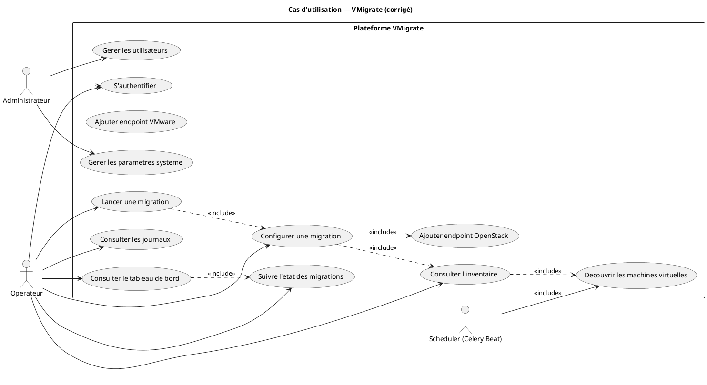
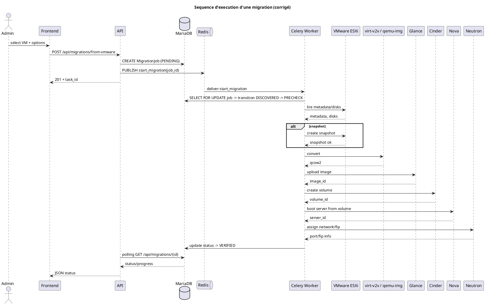
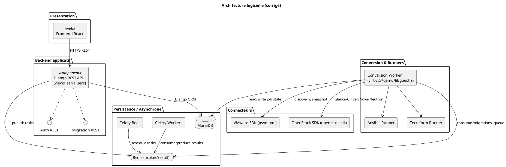
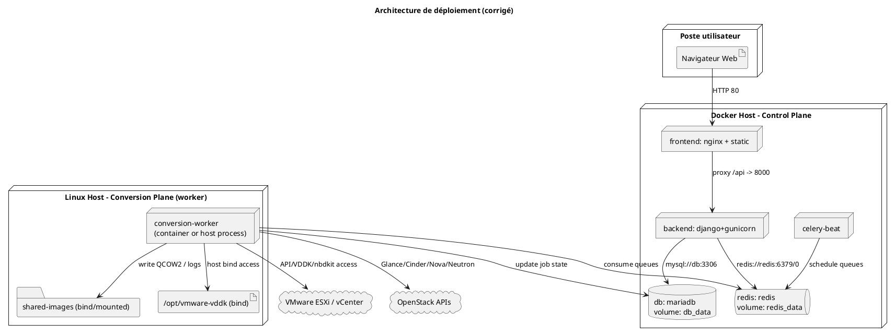
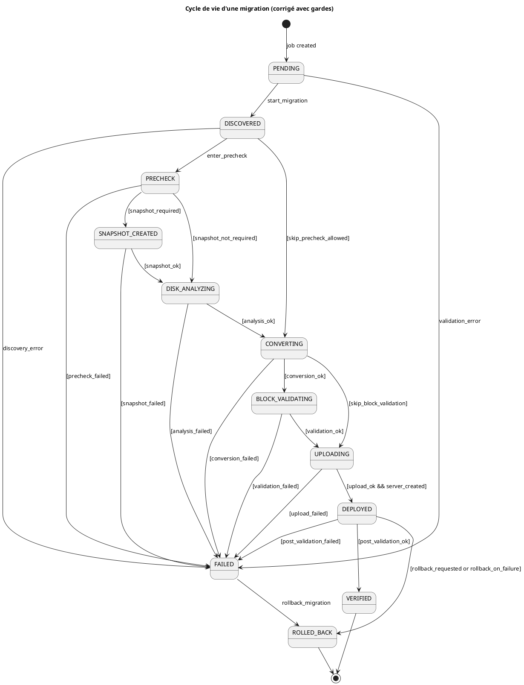
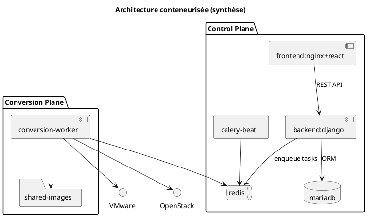
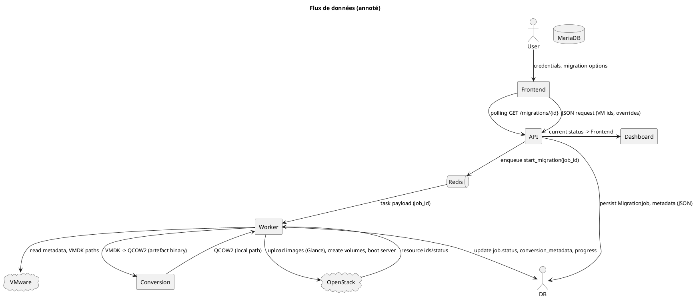

<!--
  VMigrate UML Audit: toutes les figures (corrigées + originales) et
  textes académiques prêts pour intégration au Chapitre 3 du PFE.
-->

# VMigrate — Audit UML et Figures (PlantUML)

Ce fichier rassemble les diagrammes PlantUML corrigés (Figures 3.1 → 3.9) ainsi que les textes académiques complets (titre, numéro, emplacement, introduction et analyse) prêts à être insérés dans le Chapitre 3 du rapport PFE.

---

## Figure 3.1 - Diagramme des cas d'utilisation (corrigé)



**Titre académique final:** Diagramme des cas d'utilisation de la plateforme VMigrate

**Numéro de figure recommandé:** Figure 3.1

**Emplacement:** Chapitre 3 — Section "Expression des besoins fonctionnels"

**Texte d'introduction (avant la figure):**

Le diagramme de cas d'utilisation présente les fonctionnalités exposées aux rôles `Administrateur` et `Opérateur` ainsi que l'activité automatisée du scheduler pour la découverte périodique des endpoints.

**Texte d'analyse (après la figure):**

La figure illustre la couverture fonctionnelle offerte par l'interface web et l'API : gestion des endpoints, inventaire, configuration et orchestration des migrations. Les relations `<<include>>` rendent explicites les dépendances obligatoires (p.ex. la configuration d'une migration nécessite l'inventaire et un endpoint cible). L'ajout du `Scheduler` souligne l'automatisation de la découverte périodique.

---

## Figure 3.2 - Workflow métier — Migration VMware → OpenStack (corrigé)

```plantuml
@startuml
title Workflow de migration (swimlanes)
|Administrateur|
:Se connecter et sélectionner VM;
:Soumettre demande de migration;
|API Django|
:Valider payload;
:Créer MigrationJob (PENDING) en DB;
:Publier tâche Celery -> Redis;
|Celery Worker|
:Consommer tâche start_migration;
:Lock job (select_for_update) -> DISCOVERED -> PRECHECK;
if (Precheck OK?) then (oui)
  if (Snapshot demandé?) then (oui)
    |VMware|
    :Créer snapshot ESXi;
    |Celery Worker|
    if (Snapshot OK?) then (oui) else (non)
      :Marquer FAILED; -> rollback
      stop
    endif
  else (non)
    :Ignorer snapshot;
  endif
  :Analyser disques;
  :Lancer conversion (virt-v2v / qemu-img / ansible);
  if (Conversion OK?) then (oui) else (non)
    :Journaliser erreur persistante;
    :Marquer FAILED;
    :Enqueue rollback;
    stop
  endif
  :Valider blocs & filesystem;
  if (Validations OK?) then (oui)
    |OpenStack|
    :Upload image -> Glance;
    :Créer volumes Cinder, boot Nova;
    :Vérifier serveur et volumes;
  else (non)
    :Marquer FAILED; :Enqueue rollback; stop
  endif
  if (Vérif finale OK?) then (oui)
    :Marquer VERIFIED;
  else (non)
    :Marquer FAILED; :Enqueue rollback;
  endif
else (non)
  :Marquer FAILED; :Enqueue rollback;
endif
stop
@enduml
```

**Titre académique final:** Workflow métier de migration VMware → OpenStack

**Numéro de figure recommandé:** Figure 3.2

**Emplacement:** Chapitre 3 — Section "Processus métier de migration"

**Texte d'introduction (avant la figure):**

Ce diagramme d'activité décrit la chaîne de traitement d'une migration depuis la soumission par l'utilisateur jusqu'à la vérification finale et le cas de rollback automatique.

**Texte d'analyse (après la figure):**

Le workflow met en évidence la séparation des responsabilités entre l'API et les workers Celery, le verrouillage transactionnel côté base de données, les étapes de précheck, conversion, validation et upload, ainsi que les branches d'erreur déclenchant un rollback. Cette formalisation permet de définir des points de test et de surveillance précis.

---

## Figure 3.3 - Séquence d'exécution d'une migration (corrigé)



**Titre académique final:** Séquence d'exécution nominale d'une migration

**Numéro de figure recommandé:** Figure 3.3

**Emplacement:** Chapitre 3 — Section "Architecture dynamique"

**Texte d'introduction (avant la figure):**

La séquence met en lumière les échanges temporels entre utilisateur, frontend, API, broker Redis, workers et services externes (VMware et OpenStack).

**Texte d'analyse (après la figure):**

La figure confirme l'architecture asynchrone : l'API publie une tâche et le worker exécute les opérations d'infrastructure. Le diagramme explicite le verrou DB (`SELECT FOR UPDATE`), la création d'artefacts et les interactions service‑par‑service d'OpenStack.

---

## Figure 3.4 - Architecture logicielle (composants) (corrigé)



**Titre académique final:** Architecture logicielle de VMigrate (composants)

**Numéro de figure recommandé:** Figure 3.4

**Emplacement:** Chapitre 3 — Section "Architecture logicielle de la solution"

**Texte d'introduction (avant la figure):**

Ce diagramme de composants représente les modules logiciels, leurs adaptateurs et les intégrations externes (VMware, OpenStack) ainsi que le rôle de Celery dans l'orchestration.

**Texte d'analyse (après la figure):**

La séparation claire entre `Presentation`, `Backend applicatif`, `Persistance/Asynchrone` et `Conversion` reflète l'architecture du dépôt. L'usage d'adaptateurs (`VMwareSDK`, `OpenStackSDK`) facilite le test et le remplacement, tandis que Celery assure le découplage temporel.

---

## Figure 3.5 - Architecture de déploiement (corrigé)



**Titre académique final:** Architecture de déploiement conteneurisée de VMigrate

**Numéro de figure recommandé:** Figure 3.5

**Emplacement:** Chapitre 3 — Section "Architecture de déploiement conteneurisée"

**Texte d'introduction (avant la figure):**

Le diagramme décrit le déploiement en deux plans : un control plane (frontend, backend, Redis, MariaDB, beat) et un conversion plane (worker) disposant des bibliothèques lourdes et d'un bind vers VDDK et un répertoire d'artefacts.

**Texte d'analyse (après la figure):**

La séparation minimise l'empreinte du control plane et confine les dépendances de virtualisation (virt-v2v, qemu, libguestfs, VDDK) sur des workers dédiés. Les volumes et bind mounts sont essentiels pour persister les artefacts QCOW2 et pour exposer VDDK au container.

---

## Figure 3.6 - Modèle conceptuel des données (corrigé)

```plantuml
@startuml
title Modèle conceptuel des données (corrigé)
hide circle
skinparam classAttributeIconSize 0

class User {
  +id: int
  +username: string
  +email: string
  +role: Role
  +created_at: DateTime
}

class MigrationJob {
  +id: int
  +vm_name: string
  +status: Status
  +conversion_metadata: JSON
  +progress_percent: int
  +current_step: string
  +created_at: DateTime
}

class DiscoveredVM {
  +id: int
  +name: string
  +source: Source
  +cpu: int
  +ram: int
  +disks: JSON
  +metadata: JSON
  +power_state: string
  +last_seen: DateTime
}

class VmwareEndpointSession {
  +id: int
  +host: string
  +username: string
  +password: EncryptedString
  +datacenter: string
}

class OpenstackEndpointSession {
  +id: int
  +auth_url: string
  +username: string
  +password: EncryptedString
  +project_name: string
}

class OpenStackProvisioningRun {
  +id: int
  +task_id: string
  +state: string
}

enum Role { SUPER_ADMIN, USER }
enum Status { PENDING, DISCOVERED, PRECHECK, SNAPSHOT_CREATED, DISK_ANALYZING, CONVERTING, BLOCK_VALIDATING, UPLOADING, DEPLOYED, VERIFIED, FAILED, ROLLED_BACK }

User "1" --> "0..*" MigrationJob : "cree"
User "1" --> "0..*" VmwareEndpointSession : "possede"
User "1" --> "0..*" OpenstackEndpointSession : "possede"
User "1" --> "0..*" OpenStackProvisioningRun : "lance"

VmwareEndpointSession "1" --> "0..*" DiscoveredVM : "decouvre" 

MigrationJob ..> DiscoveredVM : "référence logique\n(via conversion_metadata)" 
MigrationJob ..> VmwareEndpointSession : "référence id (metadata)"
MigrationJob ..> OpenstackEndpointSession : "référence id (metadata)"
@enduml
```

**Titre académique final:** Modèle conceptuel et persistance des entités

**Numéro de figure recommandé:** Figure 3.6

**Emplacement:** Chapitre 3 — Section "Modèle conceptuel et persistance"

**Texte d'introduction (avant la figure):**

Le diagramme présente les entités principales persistées par l'application et précise la nature des relations (FK vs références JSON stockées dans `conversion_metadata`).

**Texte d'analyse (après la figure):**

Il met en évidence la décision d'implémentation : certaines associations (p.ex. référence à la VM source) sont stockées sous forme JSON plutôt que par FKs explicites. Ceci a des implications pour l'intégrité référentielle et la facilité des jointures côté base.

---

## Figure 3.7 - Cycle de vie d'une migration (états) (corrigé)



**Titre académique final:** Machine d'états du `MigrationJob`

**Numéro de figure recommandé:** Figure 3.7

**Emplacement:** Chapitre 3 — Section "Gestion des états et fiabilité du workflow"

**Texte d'introduction (avant la figure):**

La machine d'états formalise les transitions possibles d'un `MigrationJob` implémentées dans le modèle Django (constante `TRANSITIONS`).

**Texte d'analyse (après la figure):**

Les gardes rendent explicites les conditions influençant les transitions (précheck, snapshot, validations). Cette formalisation facilite la conception des tests unitaires et d'intégration pour chaque transition critique.

---

## Figure 3.8 - Architecture conteneurisée (synthèse)



**Titre académique final:** Architecture conteneurisée — control plane vs conversion plane

**Numéro de figure recommandé:** Figure 3.8

**Emplacement:** Chapitre 3 — Section "Architecture Docker et orchestration"

**Texte d'introduction (avant la figure):**

Figure synthétique montrant la séparation entre les services applicatifs et les workers dédiés à la conversion, ainsi que les flux de messages via Redis.

**Texte d'analyse (après la figure):**

La séparation limite les dépendances lourdes dans le control plane et facilite l'évolutivité et la maintenance. Le schéma illustre aussi l'emplacement naturel des artefacts et la nécessité de volumes/bind mounts.

---

## Figure 3.9 - Flux de données (annoté)



**Titre académique final:** Flux de données au sein de VMigrate

**Numéro de figure recommandé:** Figure 3.9

**Emplacement:** Chapitre 3 — Section "Flux de données et communication inter-composants"

**Texte d'introduction (avant la figure):**

Le diagramme trace la circulation des données : requêtes utilisateur, persistance en base, messages Celery, artefacts de conversion et ressources OpenStack.

**Texte d'analyse (après la figure):**

La figure met en évidence les types de données transportés (JSON de job, artefacts binaires QCOW2, identifiants OpenStack) et montre pourquoi l'architecture asynchrone est requise pour les opérations longues. Elle identifie aussi les points critiques pour la sécurité et la rétention des artefacts.

---

<!-- Fin du fichier: toutes les figures 3.1→3.9 + textes académiques -->
